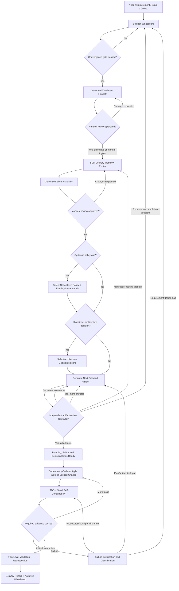

# Spec-Driven Delivery Playbook

Turn a need, requirement, issue, or defect into a reviewable product change
through a repeatable combination of:

- **Solution discovery** — structured discussion before implementation.
- **Specification-driven development (SDD)** — approved needs and system
  contracts drive the solution and tasks.
- **Test-driven development (TDD)** — tests expose defects early and provide
  traceable quality evidence.
- **Agile incremental delivery** — small, self-contained changes keep the
  integration target working.
- **Stateful execution** — every artifact records current state, next action,
  blockers, decisions, and evidence.
- **Progressive governance** — specialized policies are created when real
  systemic problems reveal a policy gap, not speculated at project inception.

This repository is a reusable playbook, not a claim that one workflow fits every
team. Instantiate the templates, select project-specific values, and preserve
the distinction between stable policies and feature delivery records.

## The core idea

Always begin with a solution whiteboard. Once discussion converges, generate a
small handoff document from its structured conclusion and review it. Approval
of that version triggers the delivery workflow automatically or through an
explicit case-by-case invocation. The workflow classifies the change, selects
the smallest safe route, reuses active project policies, and generates only the
artifacts the delivery needs. Each generated artifact is reviewed before a
dependent artifact proceeds.



The workflow is intentionally not a one-way waterfall. Review and delivery
evidence can return work to the upstream artifact that owns the problem. The
diagram abbreviates selected policy, audit, ADR, contract, plan, and runbook
documents as one-at-a-time artifacts in the generation/review loop.

## Three kinds of artifacts

### 1. Project policies — instantiate once, reuse continuously

- Development policy
- Test strategy
- Pull-request and branch policy
- Active specialized policies

These are inputs to feature delivery. Do not generate slightly different copies
for every feature.

### 2. Feature artifacts — create per non-trivial need

- Solution whiteboard
- Reviewed whiteboard-to-workflow handoff
- Delivery workflow and artifact manifest
- Compact or full implementation plan
- Optional ADRs and specialized-policy adoption work
- Task/PR/test evidence
- Retrospective and delivery record

### 3. Historical records — preserve why and what happened

- Concluded whiteboard with rejected alternatives
- Accepted and superseded ADRs
- Completed task/evidence history
- Failure justifications
- Delivery retrospective
- Final delivery record

Historical artifacts are not reset for reuse. Start from a fresh template and
link prior records when later work depends on them.

## Start here

### Bootstrap a project

1. Instantiate the
   [development policy](templates/policies/development-policy.md).
2. Instantiate the [test strategy](templates/testing/test-strategy.md).
3. Instantiate the
   [PR and branch policy](templates/policies/pull-request-policy.md).
4. Create the project's specialized-policy registry. Do not create policies for
   domains that are not yet applicable.
5. Record canonical locations, owners, review dates, and change authority.

### Start a need or requirement

1. Copy the
   [solution whiteboard](templates/discovery/solution-whiteboard.md).
2. Discuss facts, assumptions, requirements, gaps, alternatives, PoCs,
   trade-offs, YAGNI, risks, and possible policy gaps.
3. Mark incorrect proposals `REJECTED` with a concise reason rather than
   deleting them.
4. Pass the convergence gate and freeze the handoff source in the whiteboard.
5. Generate and review the
   [whiteboard-to-workflow handoff](templates/handoffs/whiteboard-to-workflow.md).
6. After explicit handoff approval, automatically trigger routing or invoke it
   manually for the case, then copy the
   [SDD delivery workflow](templates/workflows/sdd-delivery-workflow.md).
7. Use the approved handoff to classify the delivery and produce its artifact
   manifest.
8. Review the manifest, then instantiate and independently review one selected
   artifact at a time in dependency order.
9. Implement dependency-ready tasks under the project test and PR policies.
10. Reconcile evidence, run the retrospective, and archive the delivery packet.

## Delivery routes

| Route | Use when | Typical generated artifacts |
| --- | --- | --- |
| Route 0 — Documentation/trivial | No product behavior or material risk changes | Whiteboard, manifest, PR/document validation |
| Route 1 — Small production change | One coherent, low-risk production task | Compact plan, TDD evidence, PR, compact record |
| Route 2 — Multi-task feature/refactor | Several dependency-ordered increments | Full plan/contracts, task PRs, full validation/record |
| Route 3 — Systemic design/policy gap | Cross-feature invariant, hard-to-reverse architecture, or existing-system audit | Specialized policy and/or ADR, audit, full plan, remediation tasks |
| Route 4 — Incident/emergency | Urgent bounded mitigation | Emergency manifest/evidence, retrospective, permanent-remediation workflow |

Line count alone never selects a route. A small change to billing, locking,
authorization, or external side effects may require Route 3.

## Artifact selection

The workflow creates a delivery manifest using explicit decisions:

- `REUSE` — use an active project artifact.
- `UPDATE_EXISTING` — change an existing authority through review.
- `GENERATE` — instantiate a selected template.
- `GENERATE_COMPACT` / `GENERATE_FULL` — select plan depth.
- `SKIP` — not applicable, with a reason.
- `DEFER` — safe to postpone, with owner and durable destination.
- `BLOCKED` — a required authority or input is unavailable.

This prevents document inflation while making omissions reviewable.

## Template catalog

| Template | Purpose |
| --- | --- |
| [Development policy](templates/policies/development-policy.md) | Project-wide delivery, YAGNI, state, policy discovery, handoff, retrospective, and archive rules |
| [Specialized policy](templates/policies/specialized-policy.md) | Standardized creation, audit, adoption, enforcement, and review of a mid-project systemic policy |
| [PR and branch policy](templates/policies/pull-request-policy.md) | Branch models, review readiness, PR evidence, merge, emergency, and post-merge rules |
| [Test strategy](templates/testing/test-strategy.md) | TDD, risk/contract traceability, environments, bug-finding methods, performance, and failure triage |
| [Solution whiteboard](templates/discovery/solution-whiteboard.md) | Needs, facts, assumptions, options, PoCs, policy gaps, decisions, and convergence |
| [Whiteboard-to-workflow handoff](templates/handoffs/whiteboard-to-workflow.md) | Reviewed data contract and automatic/manual trigger between concluded discovery and delivery routing |
| [Delivery workflow](templates/workflows/sdd-delivery-workflow.md) | Whiteboard-input routing, artifact selection, gates, feedback loops, and completion packet |
| [Implementation plan](templates/delivery/implementation-plan.md) | Approved feature contracts, design, incremental tasks, tracking, evidence, and closure |
| [Architecture decision record](templates/decisions/architecture-decision-record.md) | Durable rationale and consequences for a significant architectural choice |

## Worked example

The [parallel provider submissions example](examples/parallel-provider-submissions/README.md)
starts with a need to remove sequential provider execution. It demonstrates:

1. several rounds of whiteboard discussion;
2. corrections and rejected approaches;
3. a concluded requirements/solution handoff;
4. generation, review, and approval of the workflow-input connector;
5. Route 3 manifest generation and review;
6. one-at-a-time artifact review before dependent generation;
7. an ADR for queue-per-submission topology;
8. reuse—not regeneration—of project test, PR, and locking policies;
9. a full implementation plan with small dependency-ordered tasks; and
10. the exact gate that marks the example ready for implementation.

The example stops at the `READY` gate and lists the project-specific evidence
still required to pass it; it does not fabricate implementation or passing test
evidence.

## Small, self-contained delivery

Use LOC as a reviewability signal, not a substitute for conceptual cohesion.
A project may choose a target such as approximately 300 changed production
lines per task while excluding tests and documentation from planning size. A
change still needs its related tests, contracts, migration, observability, and
documentation, and it must leave the integration target working.

Google's published engineering guidance similarly emphasizes one
self-contained change, related tests, and a working system rather than a
universal hard line count: [Small CLs](https://google.github.io/eng-practices/review/developer/small-cls.html).

## Test evidence, not test theater

The test strategy template avoids undefined claims such as “90% E2E coverage.”
Instead, it requires named denominators:

- required system contracts;
- critical user journeys;
- supported environments/providers;
- state and failure transitions;
- security and data boundaries; and
- performance workloads and budgets.

Code coverage is one signal. Google likewise notes that there is no universal
ideal coverage number and warns against turning percentages into checkboxes:
[Code Coverage Best Practices](https://testing.googleblog.com/2020/08/code-coverage-best-practices.html).

## Progressive policy discovery

You cannot know every specialized policy at project inception. Every whiteboard
and plan performs an applicability scan. A systemic gap follows this flow:

```text
problem discovered
    -> local-versus-systemic classification
    -> POLICY_GAP
    -> specialized-policy draft
    -> existing-system audit
    -> risk-ordered remediation
    -> enforce for new/changed work
    -> activation and periodic review
```

A local decision stays in the plan or ADR. A durable cross-feature rule becomes
a policy. This applies YAGNI to governance itself.

## Keeping templates current

Templates have owners, version/review metadata, external sources, and change
history. New industry guidance does not automatically rewrite an active
obligation. Assess applicability, trade-offs, migration impact, and affected
examples through review.

See [Template Governance](docs/template-governance.md) and
[Contributing](CONTRIBUTING.md).

## Methodology references

These sources inform the playbook but do not override an instantiated project's
contracts:

- [GitHub Spec Kit — Agentic SDD](https://github.github.com/spec-kit/reference/agentic-sdd.html)
- [Software Engineering at Google — Documentation](https://abseil.io/resources/swe-book/html/ch10.html)
- [Google Engineering Practices — Small CLs](https://google.github.io/eng-practices/review/developer/small-cls.html)
- [Microsoft — Architecture Design Specification](https://learn.microsoft.com/en-us/azure/well-architected/architect-role/architecture-design-specification)
- [Microsoft — Architecture Decision Records](https://learn.microsoft.com/en-us/azure/well-architected/architect-role/architecture-decision-record)
- [Microsoft — How Microsoft Develops with DevOps](https://learn.microsoft.com/en-us/devops/develop/how-microsoft-develops-devops)
- [AWS Prescriptive Guidance — ADR Process](https://docs.aws.amazon.com/prescriptive-guidance/latest/architectural-decision-records/adr-process.html)
- [The Scrum Guide](https://scrumguides.org/scrum-guide.html)

## License

No license has been selected yet. Until the repository owner adds one, do not
assume permission for external redistribution. Template content can still be
reviewed and used within the repository owner's authorized environment.
