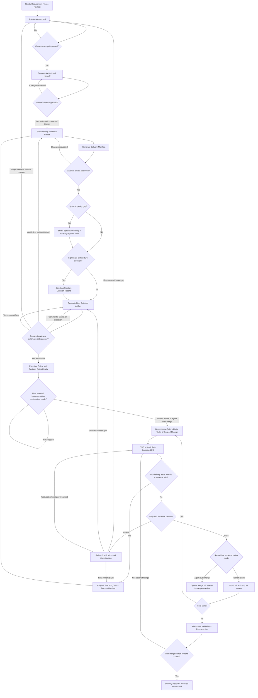
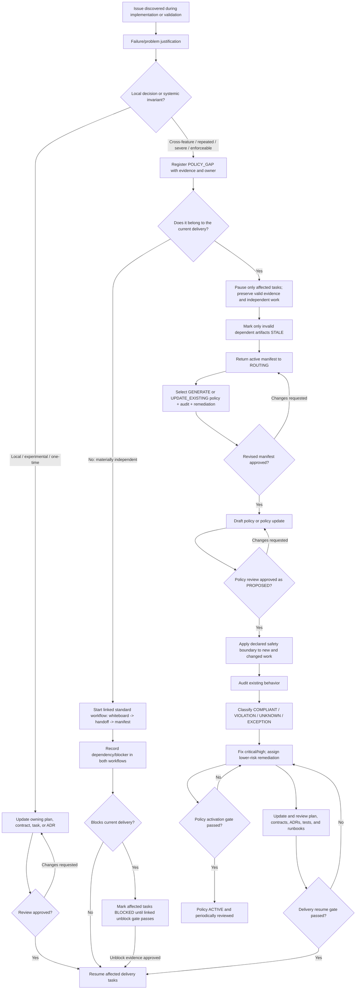
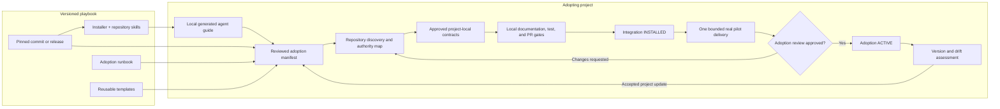
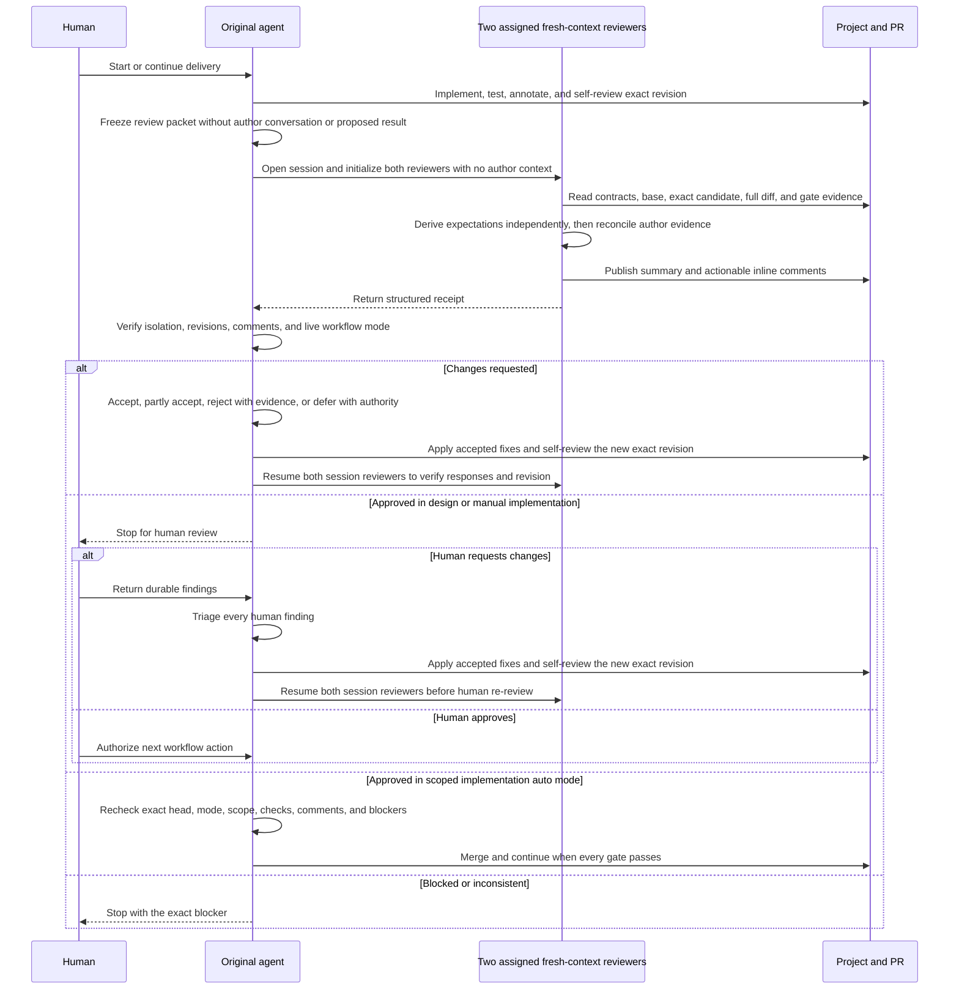

# Spec-Driven Delivery Playbook

**Turn an uncertain request into a reviewable product change—without losing the
decisions, evidence, or context that make it safe to ship.**

The Spec-Driven Delivery Playbook gives humans and coding agents one practical
workflow for discovering the right solution, defining its contracts, delivering
it in working increments, and preserving an auditable development history. It
combines SDD, TDD, Agile delivery, stateful execution, and progressive
governance without forcing every project to generate every document.

## What the playbook gives you

| Capability | What it helps you do |
| --- | --- |
| Guided project adoption | Reconcile the playbook with an existing repository instead of replacing project authority |
| Solution whiteboarding | Turn needs, issues, and defects into reviewed requirements and decisions before implementation |
| Spec-driven routing | Select only the contracts, policies, decisions, plans, and runbooks a change actually needs |
| Stateful delivery | Track the current gate, next action, blockers, dependencies, evidence, and immutable history |
| TDD and failure triage | Use tests to find product defects and justify failures before changing either code or tests |
| Safe incremental delivery | Ship the smallest self-contained change that keeps its integration target working |
| Parallel-delivery isolation | Keep multi-task features independent through feature and task branch boundaries |
| Two-agent review sessions | Start each gate with two fresh reviewers and retain both across every revision round |
| Controlled automation | Continue deterministic steps automatically and optionally merge scoped implementation PRs after every gate passes |
| Evolving governance | Add or strengthen specialized policies when real delivery evidence exposes a systemic gap |
| Versioned upgrades | Assess and migrate a project's pinned playbook revision without silently changing active contracts |
| Documentation quality gates | Check Markdown, links, anchors, diagrams, placeholders, secrets, paths, and lifecycle invariants |

The playbook remains adaptable: project-owned contracts are authoritative,
templates are selected rather than copied wholesale, and human approval remains
mandatory for design and governance decisions.

### Try it in a project

Clone this repository, copy the installer into the target project root, and run
it there:

```bash
git clone https://github.com/hhhhhusky777/spec-driven-delivery-playbook.git
cp spec-driven-delivery-playbook/install-sdd.sh /path/to/project/
cd /path/to/project
./install-sdd.sh
```

Then give the agent only the prompt printed by the installer. The generated
guide verifies the playbook revision and leads the project through adoption to
its first empty solution whiteboard. See [Adopt and use the playbook](#adopt-and-use-the-playbook)
for the complete procedure.

## Contents

- [What the playbook gives you](#what-the-playbook-gives-you)
- [Understand the delivery model](#understand-the-delivery-model)
  - [The core idea](#the-core-idea)
  - [Mid-delivery policy-gap rerouting](#mid-delivery-policy-gap-rerouting)
  - [Three kinds of artifacts](#three-kinds-of-artifacts)
- [Adopt and use the playbook](#adopt-and-use-the-playbook)
  - [Project adoption architecture](#project-adoption-architecture)
  - [How to use](#how-to-use)
    - [First-time project adoption](#first-time-project-adoption)
    - [Upgrade an installed project](#upgrade-an-installed-project)
    - [Review and resume adoption](#review-and-resume-adoption)
    - [Discuss a need](#discuss-a-need)
    - [Deliver future needs](#deliver-future-needs)
    - [Use this playbook for this repository](#use-this-playbook-for-this-repository)
- [Choose the delivery route and artifacts](#choose-the-delivery-route-and-artifacts)
- [Deliver safely](#deliver-safely)
- [Evolve and verify governance](#evolve-and-verify-governance)
- [References](#references)

## Understand the delivery model

### The core idea

Always begin with a solution whiteboard. Once discussion converges, generate a
small handoff document from its structured conclusion and review it. Approval
of that version triggers the delivery workflow automatically or through an
explicit case-by-case invocation. The workflow classifies the change, selects
the smallest safe route, reuses active project policies, and generates only the
artifacts the delivery needs. Each action follows its pre-approved review mode;
only deterministic, non-semantic steps may continue automatically before the
next mandatory review checkpoint. Separately, after all design gates pass, the
user may authorize scoped implementation PR auto-merge with exact-revision
self-review, repository gates, and post-merge human review.



The workflow is intentionally not a one-way waterfall. Review and delivery
evidence can return work to the upstream artifact that owns the problem. The
diagram abbreviates selected policy, audit, ADR, contract, plan, and runbook
documents as one-at-a-time artifacts in the generation/review loop.

### Mid-delivery policy-gap rerouting

A policy gap can be discovered after implementation starts. Do not quietly add
a feature-local rule, discard valid work, or automatically open an unrelated
delivery. Classify the problem first:

- keep a local or one-time decision in the owning plan, contract, task, or ADR;
- reroute the active manifest when the systemic rule is part of the current
  delivery; or
- start and link a separate standard workflow when the issue is materially
  independent, recording whether it blocks the current delivery.

Only affected work pauses. A reviewed `PROPOSED` safety rule may govern new and
changed code while the existing-system audit and remediation continue, but the
policy becomes `ACTIVE` only after its activation gate passes.

This is the canonical visual explanation of the rerouting path:



For example, if a feature review discovers object-storage I/O while database
rows are locked, first record the observed and expected transaction boundary.
Because the rule protects multiple callers against deadlock and availability
risk, register a systemic policy gap in the active delivery. Pause only tasks
that use the unsafe helper, reroute and review the manifest, propose the locking
policy update, audit existing callers, and add risk-ordered remediation. Resume the
affected feature after its explicit gate passes; activate the policy only after
its separate activation gate passes.

### Three kinds of artifacts

#### 1. Project governance — establish once, maintain continuously

- Project adoption manifest and contract registry
- Development policy
- Test strategy
- Pull-request and branch policy
- Active specialized policies

These are inputs to feature delivery. The adoption manifest maps the playbook
to project authority; it is not itself a replacement for the linked contracts.
Do not generate slightly different policy copies for every feature.

#### 2. Feature artifacts — create per non-trivial need

- Solution whiteboard
- Reviewed whiteboard-to-workflow handoff
- Delivery workflow and artifact manifest
- Compact or full implementation plan
- Optional ADRs and specialized-policy adoption work
- Task/PR/test evidence
- Retrospective and delivery record

#### 3. Historical records — preserve why and what happened

- Concluded whiteboard with rejected alternatives
- Accepted and superseded ADRs
- Completed task/evidence history
- Failure justifications
- Delivery retrospective
- Final delivery record
- Superseded adoption manifests and update assessments

Historical artifacts are not reset for reuse. Start from a fresh template and
link prior records when later work depends on them.

## Adopt and use the playbook

### Project adoption architecture

An established project adopts the playbook by reconciling it with existing
authority, not by copying every template. The
[Project Adoption Runbook](docs/project-adoption-runbook.md) owns the reusable
procedure. A reviewed
[project adoption manifest](templates/adoption/project-adoption-manifest.md)
records the project's pinned playbook revision, existing authorities, selected
artifacts, local gates, pilot evidence, deviations, and current state.



The project remains the authority for its own behavior and process. Existing
documents are `REUSE` candidates, but file existence is not decision-level
conformance. Adoption compares every applicable playbook obligation with
explicit project evidence. A missing decision routes to `UPDATE_EXISTING`; an
intentional alternative requires a reviewed exception with its rationale,
owner, and equivalent control. Never silently copy a playbook default into a
project contract. This applies to every applicable project-policy family, not
only PR/branch rules. If the canonical policy is incomplete, update it through
`UPDATE_EXISTING`; never generate a duplicate policy beside it. A later
playbook revision is assessed through a new manifest review and never silently
overwrites active project contracts.

Adoption agents run from the target project root. The playbook is a separate,
read-only dependency: the manifest records its canonical repository, immutable
revision, and materialization mode, while each invocation supplies and verifies
the machine-specific checkout root or immutable URL base. Local absolute paths
are runtime inputs and are never committed as project contracts.

Adoption is complete only when project-owned navigation and gates are active
at `INSTALLED` and an empty project solution whiteboard has been generated.
A need enters the playbook inside that whiteboard, not through the installer or
its agent guide. One real bounded delivery supplies the additional evidence for `ACTIVE`. An
external-project teaching example pins public revisions, separates facts from
hypothetical additions, and never implies affiliation, endorsement, unobserved
testing, or authority to change that project. It ends as `EXAMPLE_REVIEWED`,
not `ACTIVE`.

### How to use

#### First-time project adoption

1. Copy [`install-sdd.sh`](install-sdd.sh) to the target project root and run
   it. By default it resolves the latest `main` to an immutable commit.
2. Give the agent only the prompt printed by the installer: follow the
   generated `.sdd-runtime/agent-guide.md` exactly. The guide records the
   verified playbook checkout, revision, selected skill, and cleanup metadata.
3. Let the selected skill create or resume the
   [project adoption manifest](templates/adoption/project-adoption-manifest.md),
   then stop for independent bootstrap review.
4. After bootstrap approval, keep the manifest in `DISCOVERY` and follow the
   same guide for one bounded inventory of existing project authorities.
5. Independently review the inventory. Approval records
   `DISCOVERY -> MAPPED`; comments keep the manifest in `DISCOVERY`.
6. Classify each capability as `REUSE`, `UPDATE_EXISTING`, `GENERATE`, `SKIP`,
   `DEFER`, or `BLOCKED`. `REUSE` requires recorded decision-level conformance,
   not merely an existing filename; missing decisions require
   `UPDATE_EXISTING`, and accepted alternatives require a reviewed exception.
7. Generate or update one selected project-local contract, navigation entry,
   or gate at a time. Independently review each artifact before continuing.
8. After all selected artifacts and installation evidence are approved, record
   `MAPPED -> INSTALLED`.
9. Follow the same guide once more to generate and review the empty project
   solution whiteboard. The installer and guide do not collect a need.
10. Before recording the first need, replace the completed adoption runtime:
    run `./install-sdd.sh --cleanup`, then `./install-sdd.sh`. Verify that the
    new guide detects `INSTALLED`, selects `sdd-project-workflow`, and preserves
    the manifest's pinned playbook revision. Do not clean up before the empty
    whiteboard and adoption boundary are approved.
11. Run `./install-sdd.sh --validate`. Continue on `CURRENT`, or on
    `STATE_ADVANCED` only when the same workflow profile and skill remain
    compatible. Diagnose `STALE_RUNTIME` or `INVALID_RUNTIME` before use.

The generated guide and temporary checkout are machine-local runtime inputs,
not project contracts. The skill copies only the canonical repository,
immutable revision, and materialization mode into the durable manifest. An
existing manifest remains authoritative for its pinned revision; upgrading to
a later playbook revision is a separate reviewed operation.

#### Upgrade an installed project

Run an upgrade only between implementation tasks, with no task PR, merge,
self-review, or validation in flight:

```bash
./install-sdd.sh --upgrade
```

Add `--revision REVISION` to assess a specific branch, tag, or commit; otherwise
the candidate is the latest `main`, resolved to an immutable commit. The
installer verifies the current project/runtime boundary and candidate ancestry,
installs the candidate's `sdd-playbook-upgrade` skill, and prints:

```text
Follow .sdd-runtime/playbook-upgrade-guide.md exactly.
```

The preflight does not change the manifest pin and does not declare semantic
compatibility. The agent creates a project-owned upgrade assessment, compares
the exact revisions and affected project authorities, self-reviews it, creates
exactly two fresh-context reviewers, and then stops for human approval. After
both reviewers approve, it migrates one reviewed boundary at a time, validates before final
cutover, then updates the manifest pin once. Finally run
`./install-sdd.sh --cleanup`, regenerate the normal guide
with `./install-sdd.sh`, and require `./install-sdd.sh --validate` to pass.
Rollback keeps or restores the previous pin. See the
[project adoption runbook](docs/project-adoption-runbook.md#11-playbook-updates-and-drift)
and [upgrade assessment template](templates/adoption/playbook-upgrade-assessment.md).

#### Review and resume adoption

Each agent invocation stops at the next mandatory review checkpoint. It may
perform more than one dependency-ready deterministic action only inside a
pre-approved, fail-closed automation boundary. The original agent first
self-reviews the exact candidate, then opens a review session with exactly two
reviewers initialized without author context. The same two reviewers handle
every revision round in that session. After both approve one exact candidate, an
authorized human may use this prompt to record approval and resume:

```text
Fresh-context review is APPROVED for <ARTIFACT_PATH> at <VERSION_OR_COMMIT>.
Fresh-context receipt: <LINK>.
Human review disposition: APPROVED.
Human reviewer/authority: <IDENTITY_OR_REVIEW_ROLE>.
Evidence/comments: <LINK_OR_NONE>.
Approved state transition: <NONE_OR_EXPLICIT_TRANSITION>.

Record only this supplied review disposition and state transition in the
adoption manifest. Then follow `.sdd-runtime/agent-guide.md` exactly. Apply the
recorded `EXPLICIT_REVIEW`, `AUTO_CONTINUE`, or `REVIEW_ON_EXCEPTION` mode to
each dependency-ready action. Continue automatically only while every declared
gate passes and the next action remains inside the approved automation
boundary. Stop at the next explicit checkpoint or exception. Do not approve
the result of the next action.
```

Approval remains scoped to the reviewed artifact and version. After each
action, compare its changed facts, links, and availability claims with every
previously approved artifact that depends on them. Record affected artifacts as
`STALE` in the manifest's freshness register and schedule the earliest
dependency-ready correction as a later one-artifact action. Do not update a
second artifact in the current invocation. Stable entry points reference the
manifest for live adoption status instead of copying temporary statements such
as "not installed yet." Final installation verification is blocked while any
applicable artifact remains `STALE`.

For the initial bootstrap-manifest approval, use `NONE` for the transition,
keep the state `DISCOVERY`, and make bounded bootstrap discovery the next
action. Use `DISCOVERY -> MAPPED` only after the completed discovery inventory
is independently approved. If review comments remain, record
`CHANGES_REQUESTED` and resolve only those comments before another independent
review; do not use the approval-and-resume prompt.

#### Discuss a need

The active runtime guide must select `sdd-project-workflow`. Reuse it when it
already matches the reviewed manifest. If a completed adoption guide still
selects `sdd-project-adoption` with cleanup `PENDING`, perform step 10 above
before entering the first need.

The manifest owns adoption state, the delivery workflow owns artifact
freshness, blockers, and next action, and the plan owns task state. Stable entry
points link to those authorities instead of copying volatile values. After
every artifact action, compute structured transitive freshness. An explicit
action stops for review; an automatic action stops if that audit finds a stale
dependant, unknown impact, or any other exception.

1. Record the need in the installed project's empty
   [solution whiteboard](templates/discovery/solution-whiteboard.md) and move
   it from `EMPTY` to `OPEN`.
2. Discuss facts, assumptions, requirements, gaps, alternatives, PoCs,
   trade-offs, YAGNI, risks, and possible policy gaps.
3. Mark incorrect proposals `REJECTED` with a concise reason rather than
   deleting them.
4. Pass the convergence gate and freeze the handoff source in the whiteboard.
5. Generate and review the
   [whiteboard-to-workflow handoff](templates/handoffs/whiteboard-to-workflow.md).
6. After explicit handoff approval, automatically trigger routing or invoke it
   manually for the case, then copy the
   [SDD delivery workflow](templates/workflows/sdd-delivery-workflow.md).
7. Use the approved handoff to classify the delivery and produce its artifact
   manifest.
8. Review the manifest, then instantiate and independently review one selected
   artifact at a time in dependency order.
9. Implement dependency-ready tasks under the project test and PR policies.
10. Reconcile evidence, run the retrospective, and archive the delivery packet.

#### Deliver future needs

Only one need may occupy the stable working-whiteboard path. The normal SDD
delivery workflow archives the concluded whiteboard with its delivery record,
verifies both links, and then creates a fresh `EMPTY` working whiteboard. It
never overwrites an active, blocked, or concluded-but-unarchived need.

If the archive removed the temporary playbook checkout, run `install-sdd.sh`
again before the next delivery and give the agent the generated-guide prompt.
The installer detects the existing manifest, reuses its pinned playbook
revision, and installs `sdd-project-workflow`. The next need then enters the
fresh whiteboard and follows the same whiteboard -> handoff -> workflow ->
delivery record cycle.

#### Use this playbook for this repository

This repository can use its own SDD delivery workflow for future needs. After
the installer and skills are merged to `main`, run `./install-sdd.sh` from this
repository root and follow `.sdd-runtime/agent-guide.md`. Because this
repository does not yet have an approved adoption manifest, that first run is a
reviewed project-adoption delivery; it is not permission to self-approve or
claim `ACTIVE`. Once its project-local manifest and empty whiteboard are
approved, later needs use the recurring workflow above.

The existing `CONTRIBUTING.md`, documentation-quality policy, template
governance, pull-request template, and CI remain authoritative during
self-adoption. The adoption must map them to `REUSE` or a reviewed disposition
rather than generating competing copies.

## Choose the delivery route and artifacts

### Delivery routes

| Route | Use when | Typical generated artifacts |
| --- | --- | --- |
| Route 0 — Documentation/trivial | No product behavior or material risk changes | Whiteboard, manifest, PR/document validation |
| Route 1 — Small production change | One coherent, low-risk production task | Compact plan, TDD evidence, PR, compact record |
| Route 2 — Multi-task feature/refactor | Several dependency-ordered increments | Full plan/contracts, task PRs, full validation/record |
| Route 3 — Systemic design/policy gap | Cross-feature invariant, hard-to-reverse architecture, or existing-system audit | Specialized policy and/or ADR, audit, full plan, remediation tasks |
| Route 4 — Incident/emergency | Urgent bounded mitigation | Compact emergency whiteboard/handoff, emergency manifest/evidence, retrospective, permanent-remediation workflow |

Line count alone never selects a route. A small change to billing, locking,
authorization, or external side effects may require Route 3.

### Artifact selection

The workflow creates a delivery manifest using explicit decisions:

- `REUSE` — use an active project artifact whose applicable decisions have
  decision-level conformance evidence in the adoption manifest.
- `UPDATE_EXISTING` — change an existing authority through review.
- `GENERATE` — instantiate a selected template.
- `GENERATE_COMPACT` / `GENERATE_FULL` — select plan depth.
- `SKIP` — not applicable, with a reason.
- `DEFER` — safe to postpone, with owner and durable destination.
- `BLOCKED` — a required authority or input is unavailable.

This prevents document inflation while making omissions reviewable.

### Template catalog

| Template | Purpose |
| --- | --- |
| [Project adoption manifest](templates/adoption/project-adoption-manifest.md) | Pinned playbook-to-project authority mapping, routing, state, enforcement, pilot evidence, activation, and drift history |
| [Agent adoption trigger](templates/adoption/agent-adoption-trigger.md) | Bounded bootstrap, one-action continuation, and empty-whiteboard initialization driven by the reviewed adoption manifest |
| [Development policy](templates/policies/development-policy.md) | Project-wide delivery, dependency/data sequencing, YAGNI, state, pre-start context receipt, policy discovery, handoff, retrospective, and archive rules |
| [Specialized policy](templates/policies/specialized-policy.md) | Standardized creation, audit, adoption, enforcement, and review of a mid-project systemic policy |
| [PR and branch policy](templates/policies/pull-request-policy.md) | Branch models, review readiness, PR evidence, merge, emergency, and post-merge rules |
| [Test strategy](templates/testing/test-strategy.md) | TDD, risk/contract traceability, environments, bug-finding methods, performance, and failure triage |
| [Solution whiteboard](templates/discovery/solution-whiteboard.md) | Needs, facts, assumptions, options, PoCs, policy gaps, decisions, and convergence |
| [Whiteboard-to-workflow handoff](templates/handoffs/whiteboard-to-workflow.md) | Reviewed data contract and automatic/manual trigger between concluded discovery and delivery routing |
| [Delivery workflow](templates/workflows/sdd-delivery-workflow.md) | Approved-handoff-input routing, artifact selection, gates, feedback loops, and completion packet |
| [Implementation plan](templates/delivery/implementation-plan.md) | Approved feature contracts, dependency/data phases, incremental tasks, tracking, evidence, and closure |
| [Architecture decision record](templates/decisions/architecture-decision-record.md) | Durable rationale and consequences for a significant architectural choice |
| [Agent self-review record](templates/reviews/agent-self-review.md) | Mandatory exact-revision audit and annotated contract-to-change map before every review gate |

The [task-specification calibration guide](docs/task-specification-calibration.md)
defines what `COMPLETE` means, separates product/system decisions from bounded
engineering discretion, and provides readiness examples.

### Worked examples

The [SGLang project-adoption example](examples/project-adoption/sglang/README.md)
uses one public project for both adoption and delivery. Its adoption walk-through
demonstrates the installer-generated guide, authority inventory, evidence-based
policy reuse or update, project entry points, review stops, cleanup, and the
empty-whiteboard boundary.

The nested [SGLang API-key redaction delivery](examples/project-adoption/sglang/delivery-api-key-redaction/README.md)
starts from a public SGLang issue and demonstrates:

1. several rounds of whiteboard discussion;
2. corrections and rejected approaches;
3. a concluded requirements/solution handoff;
4. generation, review, and approval of the workflow-input connector;
5. Route 2 manifest generation and review with security-sensitive gates;
6. one-at-a-time artifact review before dependent generation;
7. a justified decision not to create an ADR or duplicate project policies;
8. risk-based action controls and fail-closed review routing;
9. a full implementation plan with two dependency-ordered implementation
   tasks on a feature integration branch; and
10. the exact project evidence still required before implementation.

The example stops in `CONTRACT_REVIEW` and lists the project-specific evidence
still required to reach `READY`; it does not fabricate implementation or
passing test evidence.

Both examples are teaching records only. They change no SGLang file, claim no
SGLang approval, and cannot become `ACTIVE` project authority.

## Deliver safely

### Small, self-contained delivery

Deliver the smallest coherent, self-contained increment that creates a useful
or necessary system outcome. It must be reviewable, validated, and merged
independently while leaving the integration target working. It includes every
test, contract, migration, compatibility measure, observability change, and
document needed to make that boundary safe.

Independent does not mean dependency-free. An increment may depend on already
merged prerequisites, but it must not rely on unmerged follow-up work to build,
pass its required tests, preserve active behavior, or satisfy its stated
contracts. If a proposed split would leave either side incomplete or unsafe,
keep the inseparable work together. Split further when separate outcomes can
meet these conditions on their own. Numeric size is descriptive review input,
never the delivery gate.

Google's published engineering guidance similarly emphasizes one
self-contained change, related tests, and a working system rather than a
universal hard line count: [Small CLs](https://google.github.io/eng-practices/review/developer/small-cls.html).

### Branch isolation for parallel deliveries

Select the integration route from the number of implementation and merge
units in the approved plan. Discovery, planning, final-validation, and
archive-only rows do not count.

One implementation unit uses the direct route:

```text
protected branch -> task branch -> reviewed task PR -> protected branch
```

Two or more implementation units use an isolated feature route:

```text
protected branch -> feature integration branch
feature integration branch -> task branches -> reviewed task PRs -> feature integration branch
feature integration branch -> final validated reviewed PR -> protected branch
```

Each parallel delivery owns a separate feature integration branch. Task PRs
must target that branch, which remains green and is synchronized from the
protected branch. After all tasks complete, run full feature-level validation,
review the final PR to the protected branch, reconcile the merged state, and
only then archive. If a one-task delivery splits before merge, reroute its
unmerged work through a feature integration branch.

### Risk-based review gates

The default is `EXPLICIT_REVIEW`. Every such review gate requires reviews from
two newly isolated subagents of the exact candidate, followed by human review.
It remains mandatory for requirements,
solution conclusions, handoffs, routing, policies, ADRs, contracts, complete
task specifications, risk/exception decisions, and externally consequential
actions.

`AUTO_CONTINUE` permits deterministic or mechanically derived work;
`REVIEW_ON_EXCEPTION` permits a pre-authorized repeatable action. Both require
approved/current inputs, exact scope, no new semantic decision, all declared
gates passing on the output revision, and an audit record. They fail closed to
`EXPLICIT_REVIEW` on failure, ambiguity, unknown impact, drift, a stale or
blocked dependency, exception, unrelated change, or scope expansion. Automatic
work continues only until the next mandatory semantic checkpoint.

`AUTO_CONTINUED` records execution evidence; it is never an approval. Passing
automation cannot mark normative content `APPROVED`, and changing a review mode
requires explicit review. This reduces mechanical review stops without
allowing green tests to approve a wrong design.

`AUTO_CONTINUE` and `REVIEW_ON_EXCEPTION` are non-review action modes. They end
at the next review-gated artifact and cannot approve normative content. The
implementation-only `AGENT_AUTO_MERGE` choice is different: it may continue
after fresh-context approval without pre-merge human review, subject to its
exact scope and every live merge gate.

The live workflow proves that exception with `Current review phase =
IMPLEMENTATION` and a `Current review target ID` contained in the recorded mode
scope, plus a PR link in the recorded implementation repository. Scope is a
comma-separated stable-ID list, never free-text task/PR prose. A selected
auto-merge mode never waives human review for a design,
validation, or archive gate encountered during implementation.

Before every review gate, the generating or implementing agent self-reviews the
exact candidate revision against its approved inputs, scope, acceptance
criteria, policies, tests, risks, and surrounding context. For a PR, it also
adds concise author annotations to material or non-obvious hunks and maps them
to governing statements and evidence. The self-review is repeated after any
candidate change and records `SELF_REVIEW_PASSED` or `SELF_REVIEW_FAILED`.

`SELF_REVIEW_PASSED` is pre-review evidence, never approval. It does not satisfy
reviewer independence, change the selected review mode, authorize merge, or
authorize continuation by itself.

#### Fresh-context agent review design

Every review gate opens a review session with fresh reviewer context to reduce anchoring
on the author's conversation and reasoning. The original agent acts as the
coordinator: it freezes a bounded review packet, assigns exactly two reviewers
with conversation inheritance disabled, waits for their structured receipts,
triages every finding, and then resumes the delivery. The same two reviewers
verify fixes in later rounds. They read the approved documents, complete diff,
checks, and repository state directly. They perform review only; they do not
edit, merge, resolve their own comments, or continue implementation.



The durable connector is the
[fresh-context review packet and receipt](templates/reviews/fresh-context-agent-review.md).
The packet contains the exact subject and revision, governing inputs, scope,
evidence, and publication channel. It must not include the authoring chat,
private reasoning, or a recommended disposition. The reviewer first derives
expectations from source documents and the complete candidate, then reconciles
the author's annotations and self-review in a second pass.

The reviewer returns `APPROVED`, `CHANGES_REQUESTED`, or `BLOCKED`. It records
each requested change with its location, governing statement, expected and
observed behavior, impact, and required outcome. PR findings remain in inline
comments; non-PR findings are preserved in an immutable per-round review
record. The original finding is never overwritten when the author responds.

Any new candidate revision invalidates the receipt. The original agent, not
the reviewer, waits for the result and performs the next action after
rechecking the live workflow. Conceptually, a compatible agent runtime
performs:

```text
packet = freeze_review_packet(exact_candidate)
reviewers = create_agents(count = 2, inherit_author_conversation = false, input = packet)
receipts = wait_for_all(reviewers)
resume_original_agent(receipts)
```

Design, governance, adoption, upgrade, validation, and archive artifacts always
stop for human review after fresh-context approval. Implementation under
`HUMAN_REVIEW_BEFORE_MERGE` follows the same sequence. Only implementation PRs
inside a live `AGENT_AUTO_MERGE` scope may merge and continue after both agent
reviews approve and all repository gates pass; they still enter the post-merge human
review ledger.

Fresh context is process independence, not account independence. With the same
GitHub identity, the result can be recorded in the workflow ledger or a PR
comment but must not be represented as a repository-required approval from a
different actor. A separately authorized GitHub App and restricted review
gateway can provide that formal identity later; they are not required for this
review method to improve the current delivery loop.

After every design artifact and complete task specification is approved, the
user chooses the implementation continuation mode in the live delivery
workflow. `HUMAN_REVIEW_BEFORE_MERGE` pauses each task PR for review;
`AGENT_AUTO_MERGE` lets the agent merge an annotated, exact-revision
self-reviewed task PR only after all repository protections and declared gates
pass. The agent rereads this mode before each task, PR, merge, and continuation;
the user may change it at any time. Missing or invalid mode data, conflicts,
inconsistencies, failed gates, scope drift, unresolved comments, or repository
rules requiring review stop automation. Design and planning gates never use
this implementation-only choice, and all automatically merged PRs require
post-merge human review before delivery completion/archive.

#### Example: enable auto-continuation during implementation

Suppose `T01` was merged under `HUMAN_REVIEW_BEFORE_MERGE`, the workflow is
`DELIVERY_ACTIVE`, and `T02` is next. The user can change the mode with one
bounded instruction:

```text
Change the implementation continuation mode to AGENT_AUTO_MERGE for the T02
and T03 task PRs only. Do not include the final feature PR. Record this
instruction as the mode authority, then continue following the delivery
workflow.
```

The agent records the instruction in the live delivery workflow before editing
`T02`:

| Field | Example value |
| --- | --- |
| Implementation continuation mode | `AGENT_AUTO_MERGE` |
| Implementation mode authority | `Example user — instruction quoted above` |
| Implementation mode scope | `T02, T03` |
| Implementation repository | `https://github.com/example/project` |
| Implementation mode selected at | `2026-09-03 15:00 Asia/Shanghai (example)` |

Recording this exact instruction is a control-only update. The agent runs the
lifecycle check, then rereads these fields before the `T02` edit, self-review,
PR opening, merge, and `T03` continuation. It may merge only while the PR stays
inside this scope and every required check and repository protection passes.
The final feature PR remains outside the authorization.

To stop automatic merging before the next irreversible action, the user can
say:

```text
Change the implementation continuation mode to HUMAN_REVIEW_BEFORE_MERGE now.
Record this instruction and stop at the next PR review gate.
```

The agent rereads the changed value and stops before the next merge. A mode
change cannot undo a merge that already completed.

### Dependency-first data sequencing

Do not translate “dependency-ordered” into a universal rule to complete an
entire data layer before business behavior. When approved behavior depends on a
durable-data change, plan the minimum verified foundation before its consumers:

```text
contracts and state invariants
    -> additive schema / migration / constraints / data-access foundation
    -> dependent behavior and required data transition
    -> destructive cleanup after every consumer has moved
```

The development policy owns this reusable rule. The implementation plan
references the active project policy, classifies the change, and records each
task's `FOUNDATION`, `CONSUMER`, `MIGRATION`, `CLEANUP`, or `NONE` phase. A PoC
may precede the data shape, and inseparable data/behavior may remain one bounded
vertical increment when splitting it would break the integration target.

For systems with live data or mixed versions, additive changes before consumers
and destructive changes after migration preserve compatibility; see
[AWS guidance on decoupling schema and code changes](https://docs.aws.amazon.com/whitepapers/latest/blue-green-deployments/best-practices-for-managing-data-synchronization-and-schema-changes.html).

### Test evidence, not test theater

The test strategy template avoids undefined claims such as “90% E2E coverage.”
Instead, it requires named denominators:

- required system contracts;
- critical user journeys;
- supported environments/providers;
- state and failure transitions;
- security and data boundaries; and
- performance workloads and budgets.

Code coverage is one signal. Google likewise notes that there is no universal
ideal coverage number and warns against turning percentages into checkboxes:
[Code Coverage Best Practices](https://testing.googleblog.com/2020/08/code-coverage-best-practices.html).

## Evolve and verify governance

### Progressive policy discovery

You cannot know every specialized policy at project inception. Every whiteboard
and plan performs an applicability scan. A systemic gap follows this flow:

```text
problem discovered
    -> local-versus-systemic classification
    -> local: update and review the owning feature artifact
    -> systemic: register POLICY_GAP
        -> reroute the current manifest or start a linked independent workflow
        -> review a new or updated specialized policy as PROPOSED
        -> enforce its declared boundary for new/changed work
        -> existing-system audit and risk-ordered remediation
        -> delivery resume gate and policy activation gate
```

A local decision stays in the plan or ADR. A durable cross-feature rule becomes
a policy. During active delivery, pause only affected tasks and preserve valid
evidence. This applies YAGNI to governance itself; see
[Mid-delivery policy-gap rerouting](#mid-delivery-policy-gap-rerouting).

### Keeping templates current

Templates have owners, version/review metadata, external sources, and change
history. New industry guidance does not automatically rewrite an active
obligation. Assess applicability, trade-offs, migration impact, and affected
examples through review.

See [Template Governance](docs/template-governance.md) and
[Contributing](CONTRIBUTING.md).

### Documentation quality and tests

Every playbook change follows the
[Documentation Quality and Testing Policy](docs/documentation-quality-policy.md).
Automated checks cover Markdown, relative links and headings, fences, Mermaid
syntax, placeholders, likely secrets, and private/local paths. Runtime negative
tests prove each blocking rule can fail. External links remain advisory because
remote availability is not controlled by this repository.

Semantic review separately verifies correctness, clarity, concision,
cross-document consistency, canonical ownership, generated project content, and
source freshness. CI cannot approve those judgments.

Long or multi-focus artifacts use the policy's attention and reviewability gate:
a concise map routes reviewers to changed obligations, blockers, risks,
exceptions, owners, and evidence. Reviewers reconcile it against the complete
artifact; the map never replaces full review or canonical text.

Before an implementation task moves from `READY` to `IN_PROGRESS`, its
implementer converts the applicable approved sources and attention-map items
into the development policy's reviewed task context receipt. This pre-start
gate makes the task's obligations, prohibitions, boundaries, and required
evidence explicit without adding another workflow state.

Run the same blocking checks locally:

```bash
npm ci --ignore-scripts
npm run docs:all
```

Then review advisory external-link evidence with
`npm run docs:links:external`.

## References

### Methodology references

These sources inform the playbook but do not override an instantiated project's
contracts:

- [GitHub Spec Kit — Agentic SDD](https://github.github.com/spec-kit/reference/agentic-sdd.html)
- [Software Engineering at Google — Documentation](https://abseil.io/resources/swe-book/html/ch10.html)
- [Google Engineering Practices — Small CLs](https://google.github.io/eng-practices/review/developer/small-cls.html)
- [Microsoft — Architecture Design Specification](https://learn.microsoft.com/en-us/azure/well-architected/architect-role/architecture-design-specification)
- [Microsoft — Architecture Decision Records](https://learn.microsoft.com/en-us/azure/well-architected/architect-role/architecture-decision-record)
- [Microsoft — How Microsoft Develops with DevOps](https://learn.microsoft.com/en-us/devops/develop/how-microsoft-develops-devops)
- [AWS Prescriptive Guidance — ADR Process](https://docs.aws.amazon.com/prescriptive-guidance/latest/architectural-decision-records/adr-process.html)
- [AWS — Managing Data Synchronization and Schema Changes](https://docs.aws.amazon.com/whitepapers/latest/blue-green-deployments/best-practices-for-managing-data-synchronization-and-schema-changes.html)
- [The Scrum Guide](https://scrumguides.org/scrum-guide.html)

### License

No license has been selected yet. Until the repository owner adds one, do not
assume permission for external redistribution. Template content can still be
reviewed and used within the repository owner's authorized environment.
