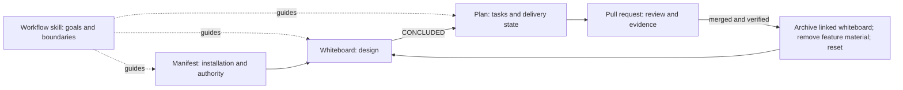
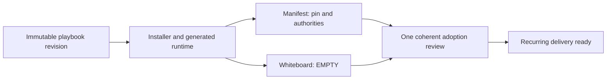

# Spec-Driven Delivery Playbook

Turn an uncertain request into a reviewable product change while preserving the
decisions, evidence, and authority needed to ship safely.

The playbook defines outcomes and boundaries. Agents choose the most
proportional route within project policy instead of following a prescribed
sequence of process documents.

## Core goals

The canonical [five goals](docs/documentation-quality-policy.md#five-goals-and-agent-judgment)
are:

| Goal | Meaning |
| --- | --- |
| Clear boundaries | Scope, authority, invariants, and evidence are explicit |
| Stable outcomes | Different valid methods still produce the agreed result |
| Key information only | Keep what decisions, verification, recovery, and maintenance need |
| Proportional effort | Match process cost to complexity, risk, and value |
| Agent discretion | Let the agent choose methods and safe recovery inside the boundaries |

The [error-handling framework](docs/error-handling.md) distinguishes an agent
mistake from a project gap, playbook gap, or critical mismatch. Correct agent
mistakes within authority, track genuine gaps, and stop only affected work when
human judgment or a protected boundary is required.

## Three durable documents

| Document | Sole responsibility |
| --- | --- |
| [Project adoption manifest](templates/adoption/project-adoption-manifest.md) | One-time installed revision, canonical project authorities, and stable boundaries |
| [Solution whiteboard](templates/discovery/solution-whiteboard.md) | One active feature's discussion and concluded design |
| [Implementation plan](templates/delivery/implementation-plan.md) | Tasks, Definition of Done, validation, and all active-delivery state |

GitHub pull requests own review comments, checks, acceptance, merge evidence,
and detailed history. Project policies remain in their existing canonical files.
The workflow skill guides delivery but owns no feature state.



## Adopt the playbook

Adoption happens once per project. Copy the installer into the target repository
and run it from that repository's root:

```bash
git clone https://github.com/hhhhhusky777/spec-driven-delivery-playbook.git
cp spec-driven-delivery-playbook/install-sdd.sh /path/to/project/
cd /path/to/project
./install-sdd.sh
```

The installer resolves an immutable playbook revision and generates a
machine-local guide. The adoption agent reconciles the playbook with existing
project authority and prepares one coherent package:

| Adoption outcome | Required result |
| --- | --- |
| Verified source | Canonical repository and immutable revision are known |
| Reusable installation | Manifest records the pin, authorities, and stable boundaries |
| Ready intake | Working whiteboard is neutral and `EMPTY` |
| Review | Two isolated agents review the exact package and the owner accepts it |
| Runtime | Managed skills and generated guide match the accepted pin |

The generated guide and temporary checkout are machine-local runtime, not
project authority. Future features reuse the accepted manifest and do not repeat
adoption.



## Deliver a feature

Discussion begins as lightweight notes in the whiteboard. Once decisions,
requirements, risks, and open items are reconciled, conclude the design and
create one implementation plan. The plan maps design points to task outcomes,
dependencies, validation, and merge boundaries while remaining the only live
delivery state.

Related preparation and corrections may be batched. Required decisions, quality
checks, independent review, human acceptance, safety controls, and merge
authority remain at their actual boundaries. The agent chooses the internal
method and does not invent another stop for every edit, tool call, or status
change.

At every human gate, provide the quality policy's concise
[review table](docs/documentation-quality-policy.md#review-and-human-brief).
For planning, show concluded design points beside task outcomes and validation
so the human can see omissions or inconsistency without rereading every file.

Implementation uses coherent, self-contained merge units. A unit may depend on
already merged work but cannot rely on a future change to make its required
outcome safe or green. Parallel agents use isolated worktrees and non-overlapping
ownership. Multiple dependent units may integrate through a feature branch;
only the final reviewed feature PR targets the protected branch.

After verified merge, archive the concluded whiteboard with links to its PRs,
remove the feature plan and other non-reusable feature material, and reset the
working whiteboard. The manifest and reusable project authority remain.

## Upgrade an installed project

Before a new feature begins, check whether the playbook source has a newer
`main` revision. At a safe boundary, run:

```bash
./install-sdd.sh --upgrade
```

Upgrade synchronizes reusable playbook material only. It may read the active
implementation plan to determine whether the boundary is safe, but it never
modifies feature design, tasks, status, or evidence. The old immutable pin stays
authoritative until the candidate passes project checks, two-agent review,
human acceptance, and cutover validation.

When parallel deliveries use different revisions, reconcile reusable files
against the newest accepted revision and preserve any still-applicable project
authority. “Newer wins” applies to superseded playbook content, not to unrelated
project decisions or silently weakened controls.

The source repository's tests validate installer and playbook behavior. They are
not installed into adopting projects and are not an upgrade responsibility for
project agents.

## Repository development

This repository self-adopts the same model. Read [Contributing](CONTRIBUTING.md),
the live manifest, and the generated `.sdd-runtime/agent-guide.md`. When a plan
exists, it owns current task and delivery state.

Source validation:

```bash
npm ci --ignore-scripts
npm run docs:all
```

See [Template Governance](docs/template-governance.md) for maintained-template
ownership and [Documentation Quality](docs/documentation-quality-policy.md) for
review, evidence, and repository checks.

## License

No license has been selected. Do not assume permission for external
redistribution outside the repository owner's authorized environment.
