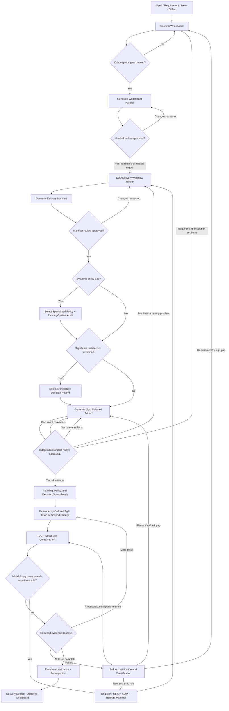
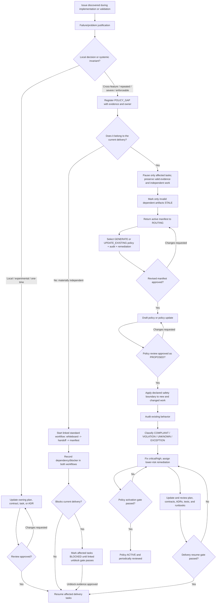
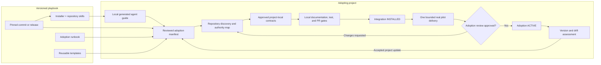

# Spec-Driven Delivery Playbook

Turn a need, requirement, issue, or defect into a reviewable product change
through a repeatable combination of:

- **Solution discovery** — structured discussion before implementation.
- **Specification-driven development (SDD)** — approved needs and system
  contracts drive the solution and tasks.
- **Test-driven development (TDD)** — tests expose defects early and provide
  traceable quality evidence.
- **Agile incremental delivery** — small, self-contained changes keep the
  integration target working.
- **Stateful execution** — every artifact records current state, next action,
  blockers, decisions, and evidence.
- **Progressive governance** — specialized policies are created when real
  systemic problems reveal a policy gap, not speculated at project inception.

This repository is a reusable playbook, not a claim that one workflow fits every
team. Instantiate the templates, select project-specific values, and preserve
the distinction between stable policies and feature delivery records.

## The core idea

Always begin with a solution whiteboard. Once discussion converges, generate a
small handoff document from its structured conclusion and review it. Approval
of that version triggers the delivery workflow automatically or through an
explicit case-by-case invocation. The workflow classifies the change, selects
the smallest safe route, reuses active project policies, and generates only the
artifacts the delivery needs. Each generated artifact is reviewed before a
dependent artifact proceeds.



The workflow is intentionally not a one-way waterfall. Review and delivery
evidence can return work to the upstream artifact that owns the problem. The
diagram abbreviates selected policy, audit, ADR, contract, plan, and runbook
documents as one-at-a-time artifacts in the generation/review loop.

## Mid-delivery policy-gap rerouting

A policy gap can be discovered after implementation starts. Do not quietly add
a feature-local rule, discard valid work, or automatically open an unrelated
delivery. Classify the problem first:

- keep a local or one-time decision in the owning plan, contract, task, or ADR;
- reroute the active manifest when the systemic rule is part of the current
  delivery; or
- start and link a separate standard workflow when the issue is materially
  independent, recording whether it blocks the current delivery.

Only affected work pauses. A reviewed `PROPOSED` safety rule may govern new and
changed code while the existing-system audit and remediation continue, but the
policy becomes `ACTIVE` only after its activation gate passes.

This is the canonical visual explanation of the rerouting path:



For example, if a feature review discovers object-storage I/O while database
rows are locked, first record the observed and expected transaction boundary.
Because the rule protects multiple callers against deadlock and availability
risk, register a systemic policy gap in the active delivery. Pause only tasks
that use the unsafe helper, reroute and review the manifest, propose the locking
policy update, audit existing callers, and add risk-ordered remediation. Resume the
affected feature after its explicit gate passes; activate the policy only after
its separate activation gate passes.

## Three kinds of artifacts

### 1. Project governance — establish once, maintain continuously

- Project adoption manifest and contract registry
- Development policy
- Test strategy
- Pull-request and branch policy
- Active specialized policies

These are inputs to feature delivery. The adoption manifest maps the playbook
to project authority; it is not itself a replacement for the linked contracts.
Do not generate slightly different policy copies for every feature.

### 2. Feature artifacts — create per non-trivial need

- Solution whiteboard
- Reviewed whiteboard-to-workflow handoff
- Delivery workflow and artifact manifest
- Compact or full implementation plan
- Optional ADRs and specialized-policy adoption work
- Task/PR/test evidence
- Retrospective and delivery record

### 3. Historical records — preserve why and what happened

- Concluded whiteboard with rejected alternatives
- Accepted and superseded ADRs
- Completed task/evidence history
- Failure justifications
- Delivery retrospective
- Final delivery record
- Superseded adoption manifests and update assessments

Historical artifacts are not reset for reuse. Start from a fresh template and
link prior records when later work depends on them.

## Project adoption architecture

An established project adopts the playbook by reconciling it with existing
authority, not by copying every template. The
[Project Adoption Runbook](docs/project-adoption-runbook.md) owns the reusable
procedure. A reviewed
[project adoption manifest](templates/adoption/project-adoption-manifest.md)
records the project's pinned playbook revision, existing authorities, selected
artifacts, local gates, pilot evidence, deviations, and current state.



The project remains the authority for its own behavior and process. Existing
documents are `REUSE` candidates by default; generate or update an artifact
only after discovery proves a gap and the project approves the route. A later
playbook revision is assessed through a new manifest review and never silently
overwrites active project contracts.

Adoption agents run from the target project root. The playbook is a separate,
read-only dependency: the manifest records its canonical repository, immutable
revision, and materialization mode, while each invocation supplies and verifies
the machine-specific checkout root or immutable URL base. Local absolute paths
are runtime inputs and are never committed as project contracts.

Adoption is complete only when project-owned navigation and gates are active
at `INSTALLED` and an empty project solution whiteboard has been generated.
A need enters the playbook inside that whiteboard, not through the installer or
its agent guide. One real bounded delivery supplies the additional evidence for `ACTIVE`. An
external-project teaching example pins public revisions, separates facts from
hypothetical additions, and never implies affiliation, endorsement, unobserved
testing, or authority to change that project. It ends as `EXAMPLE_REVIEWED`,
not `ACTIVE`.

## Start here

### Bootstrap a project

1. Copy [`install-sdd.sh`](install-sdd.sh) to the target project root and run
   it. By default it resolves the latest `main` to an immutable commit.
2. Give the agent only the prompt printed by the installer: follow the
   generated `.sdd-runtime/agent-guide.md` exactly. The guide records the
   verified playbook checkout, revision, selected skill, and cleanup metadata.
3. Let the selected skill create or resume the
   [project adoption manifest](templates/adoption/project-adoption-manifest.md).
4. Inventory and independently review existing project authorities before generating any
   policy.
5. Classify each capability as `REUSE`, `UPDATE_EXISTING`, `GENERATE`, `SKIP`,
   `DEFER`, or `BLOCKED`.
6. Install and review only the selected project-local contracts, navigation,
   and gates.
7. After recorded authority reaches `INSTALLED`, let the skill generate the
   empty project solution whiteboard. The installer and guide do not collect a
   need.

The generated guide and temporary checkout are machine-local runtime inputs,
not project contracts. The skill copies only the canonical repository,
immutable revision, and materialization mode into the durable manifest. An
existing manifest remains authoritative for its pinned revision; upgrading to
a later playbook revision is a separate reviewed operation.

### Start a need or requirement

1. Record the need in the installed project's empty
   [solution whiteboard](templates/discovery/solution-whiteboard.md) and move
   it from `EMPTY` to `OPEN`.
2. Discuss facts, assumptions, requirements, gaps, alternatives, PoCs,
   trade-offs, YAGNI, risks, and possible policy gaps.
3. Mark incorrect proposals `REJECTED` with a concise reason rather than
   deleting them.
4. Pass the convergence gate and freeze the handoff source in the whiteboard.
5. Generate and review the
   [whiteboard-to-workflow handoff](templates/handoffs/whiteboard-to-workflow.md).
6. After explicit handoff approval, automatically trigger routing or invoke it
   manually for the case, then copy the
   [SDD delivery workflow](templates/workflows/sdd-delivery-workflow.md).
7. Use the approved handoff to classify the delivery and produce its artifact
   manifest.
8. Review the manifest, then instantiate and independently review one selected
   artifact at a time in dependency order.
9. Implement dependency-ready tasks under the project test and PR policies.
10. Reconcile evidence, run the retrospective, and archive the delivery packet.

## Delivery routes

| Route | Use when | Typical generated artifacts |
| --- | --- | --- |
| Route 0 — Documentation/trivial | No product behavior or material risk changes | Whiteboard, manifest, PR/document validation |
| Route 1 — Small production change | One coherent, low-risk production task | Compact plan, TDD evidence, PR, compact record |
| Route 2 — Multi-task feature/refactor | Several dependency-ordered increments | Full plan/contracts, task PRs, full validation/record |
| Route 3 — Systemic design/policy gap | Cross-feature invariant, hard-to-reverse architecture, or existing-system audit | Specialized policy and/or ADR, audit, full plan, remediation tasks |
| Route 4 — Incident/emergency | Urgent bounded mitigation | Compact emergency whiteboard/handoff, emergency manifest/evidence, retrospective, permanent-remediation workflow |

Line count alone never selects a route. A small change to billing, locking,
authorization, or external side effects may require Route 3.

## Artifact selection

The workflow creates a delivery manifest using explicit decisions:

- `REUSE` — use an active project artifact.
- `UPDATE_EXISTING` — change an existing authority through review.
- `GENERATE` — instantiate a selected template.
- `GENERATE_COMPACT` / `GENERATE_FULL` — select plan depth.
- `SKIP` — not applicable, with a reason.
- `DEFER` — safe to postpone, with owner and durable destination.
- `BLOCKED` — a required authority or input is unavailable.

This prevents document inflation while making omissions reviewable.

## Template catalog

| Template | Purpose |
| --- | --- |
| [Project adoption manifest](templates/adoption/project-adoption-manifest.md) | Pinned playbook-to-project authority mapping, routing, state, enforcement, pilot evidence, activation, and drift history |
| [Agent adoption trigger](templates/adoption/agent-adoption-trigger.md) | Bounded bootstrap, one-action continuation, and empty-whiteboard initialization driven by the reviewed adoption manifest |
| [Development policy](templates/policies/development-policy.md) | Project-wide delivery, dependency/data sequencing, YAGNI, state, pre-start context receipt, policy discovery, handoff, retrospective, and archive rules |
| [Specialized policy](templates/policies/specialized-policy.md) | Standardized creation, audit, adoption, enforcement, and review of a mid-project systemic policy |
| [PR and branch policy](templates/policies/pull-request-policy.md) | Branch models, review readiness, PR evidence, merge, emergency, and post-merge rules |
| [Test strategy](templates/testing/test-strategy.md) | TDD, risk/contract traceability, environments, bug-finding methods, performance, and failure triage |
| [Solution whiteboard](templates/discovery/solution-whiteboard.md) | Needs, facts, assumptions, options, PoCs, policy gaps, decisions, and convergence |
| [Whiteboard-to-workflow handoff](templates/handoffs/whiteboard-to-workflow.md) | Reviewed data contract and automatic/manual trigger between concluded discovery and delivery routing |
| [Delivery workflow](templates/workflows/sdd-delivery-workflow.md) | Approved-handoff-input routing, artifact selection, gates, feedback loops, and completion packet |
| [Implementation plan](templates/delivery/implementation-plan.md) | Approved feature contracts, dependency/data phases, incremental tasks, tracking, evidence, and closure |
| [Architecture decision record](templates/decisions/architecture-decision-record.md) | Durable rationale and consequences for a significant architectural choice |

## Worked examples

The [parallel provider submissions example](examples/parallel-provider-submissions/README.md)
starts with a need to remove sequential provider execution. It demonstrates:

1. several rounds of whiteboard discussion;
2. corrections and rejected approaches;
3. a concluded requirements/solution handoff;
4. generation, review, and approval of the workflow-input connector;
5. Route 3 manifest generation and review;
6. one-at-a-time artifact review before dependent generation;
7. an ADR for queue-per-submission topology;
8. reuse—not regeneration—of project test, PR, and locking policies;
9. a full implementation plan with small dependency-ordered tasks; and
10. the exact gate that marks the example ready for implementation.

The example stops at the `READY` gate and lists the project-specific evidence
still required to pass it; it does not fabricate implementation or passing test
evidence.

The [SGLang project-adoption example](examples/project-adoption/sglang/README.md)
starts from pinned public repository and playbook revisions. It demonstrates the
exact first manifest path, bootstrap prompt, authority inventory, reuse versus
generation decisions, proposed project entry point and SDD overlay, thin agent
adapters, review stops, generated agent guide, and empty-whiteboard boundary.
It changes no SGLang file and remains `REVIEW` until independently reviewed;
even after approval it can become only `EXAMPLE_REVIEWED`, never `ACTIVE`.

## Small, self-contained delivery

Use LOC as a reviewability signal, not a substitute for conceptual cohesion.
A project may choose a target such as approximately 300 changed production
lines per task while excluding tests and documentation from planning size. A
change still needs its related tests, contracts, migration, observability, and
documentation, and it must leave the integration target working.

Google's published engineering guidance similarly emphasizes one
self-contained change, related tests, and a working system rather than a
universal hard line count: [Small CLs](https://google.github.io/eng-practices/review/developer/small-cls.html).

## Dependency-first data sequencing

Do not translate “dependency-ordered” into a universal rule to complete an
entire data layer before business behavior. When approved behavior depends on a
durable-data change, plan the minimum verified foundation before its consumers:

```text
contracts and state invariants
    -> additive schema / migration / constraints / data-access foundation
    -> dependent behavior and required data transition
    -> destructive cleanup after every consumer has moved
```

The development policy owns this reusable rule. The implementation plan
references the active project policy, classifies the change, and records each
task's `FOUNDATION`, `CONSUMER`, `MIGRATION`, `CLEANUP`, or `NONE` phase. A PoC
may precede the data shape, and inseparable data/behavior may remain one bounded
vertical increment when splitting it would break the integration target.

For systems with live data or mixed versions, additive changes before consumers
and destructive changes after migration preserve compatibility; see
[AWS guidance on decoupling schema and code changes](https://docs.aws.amazon.com/whitepapers/latest/blue-green-deployments/best-practices-for-managing-data-synchronization-and-schema-changes.html).

## Test evidence, not test theater

The test strategy template avoids undefined claims such as “90% E2E coverage.”
Instead, it requires named denominators:

- required system contracts;
- critical user journeys;
- supported environments/providers;
- state and failure transitions;
- security and data boundaries; and
- performance workloads and budgets.

Code coverage is one signal. Google likewise notes that there is no universal
ideal coverage number and warns against turning percentages into checkboxes:
[Code Coverage Best Practices](https://testing.googleblog.com/2020/08/code-coverage-best-practices.html).

## Progressive policy discovery

You cannot know every specialized policy at project inception. Every whiteboard
and plan performs an applicability scan. A systemic gap follows this flow:

```text
problem discovered
    -> local-versus-systemic classification
    -> local: update and review the owning feature artifact
    -> systemic: register POLICY_GAP
        -> reroute the current manifest or start a linked independent workflow
        -> review a new or updated specialized policy as PROPOSED
        -> enforce its declared boundary for new/changed work
        -> existing-system audit and risk-ordered remediation
        -> delivery resume gate and policy activation gate
```

A local decision stays in the plan or ADR. A durable cross-feature rule becomes
a policy. During active delivery, pause only affected tasks and preserve valid
evidence. This applies YAGNI to governance itself; see
[Mid-delivery policy-gap rerouting](#mid-delivery-policy-gap-rerouting).

## Keeping templates current

Templates have owners, version/review metadata, external sources, and change
history. New industry guidance does not automatically rewrite an active
obligation. Assess applicability, trade-offs, migration impact, and affected
examples through review.

See [Template Governance](docs/template-governance.md) and
[Contributing](CONTRIBUTING.md).

## Documentation quality and tests

Every playbook change follows the
[Documentation Quality and Testing Policy](docs/documentation-quality-policy.md).
Automated checks cover Markdown, relative links and headings, fences, Mermaid
syntax, placeholders, likely secrets, and private/local paths. Runtime negative
tests prove each blocking rule can fail. External links remain advisory because
remote availability is not controlled by this repository.

Semantic review separately verifies correctness, clarity, concision,
cross-document consistency, canonical ownership, generated project content, and
source freshness. CI cannot approve those judgments.

Long or multi-focus artifacts use the policy's attention and reviewability gate:
a concise map routes reviewers to changed obligations, blockers, risks,
exceptions, owners, and evidence. Reviewers reconcile it against the complete
artifact; the map never replaces full review or canonical text.

Before an implementation task moves from `READY` to `IN_PROGRESS`, its
implementer converts the applicable approved sources and attention-map items
into the development policy's reviewed task context receipt. This pre-start
gate makes the task's obligations, prohibitions, boundaries, and required
evidence explicit without adding another workflow state.

Run the same blocking checks locally:

```bash
npm ci --ignore-scripts
npm run docs:all
```

Then review advisory external-link evidence with
`npm run docs:links:external`.

## Methodology references

These sources inform the playbook but do not override an instantiated project's
contracts:

- [GitHub Spec Kit — Agentic SDD](https://github.github.com/spec-kit/reference/agentic-sdd.html)
- [Software Engineering at Google — Documentation](https://abseil.io/resources/swe-book/html/ch10.html)
- [Google Engineering Practices — Small CLs](https://google.github.io/eng-practices/review/developer/small-cls.html)
- [Microsoft — Architecture Design Specification](https://learn.microsoft.com/en-us/azure/well-architected/architect-role/architecture-design-specification)
- [Microsoft — Architecture Decision Records](https://learn.microsoft.com/en-us/azure/well-architected/architect-role/architecture-decision-record)
- [Microsoft — How Microsoft Develops with DevOps](https://learn.microsoft.com/en-us/devops/develop/how-microsoft-develops-devops)
- [AWS Prescriptive Guidance — ADR Process](https://docs.aws.amazon.com/prescriptive-guidance/latest/architectural-decision-records/adr-process.html)
- [AWS — Managing Data Synchronization and Schema Changes](https://docs.aws.amazon.com/whitepapers/latest/blue-green-deployments/best-practices-for-managing-data-synchronization-and-schema-changes.html)
- [The Scrum Guide](https://scrumguides.org/scrum-guide.html)

## License

No license has been selected yet. Until the repository owner adds one, do not
assume permission for external redistribution. Template content can still be
reviewed and used within the repository owner's authorized environment.
