# Spec-Driven Delivery Playbook

**Turn an uncertain request into a reviewable product change—without losing the
decisions, evidence, or authority needed to ship safely.**

The Spec-Driven Delivery Playbook helps humans and coding agents discover the
right solution, define what success means, deliver it in coherent increments,
and leave the project ready for its next feature. It combines lightweight
design discussion, explicit delivery boundaries, proportional validation, and
auditable pull-request review without prescribing one rigid path for every
project.

## What the playbook gives you

| Feature | What it helps you achieve |
| --- | --- |
| One-time project adoption | Connect the playbook to existing project authority without replacing it |
| Solution whiteboarding | Turn an uncertain need into an accepted design before dependent implementation |
| Outcome-based planning | Map design points to tasks, dependencies, validation, and Definition of Done |
| Context-native handoff | Let a fresh agent resume from repository state without inheriting another agent's chat history |
| Efficient implementation | Batch coherent work and avoid unnecessary stops while preserving real gates |
| Reliable review | Give two isolated reviewers and the owner one exact, reviewable candidate |
| Simple fail-closed recovery | Preserve consistency, expose safe client retry, and avoid speculative error machinery |
| Parallel delivery | Isolate worktrees and ownership while keeping integration boundaries explicit |
| Clean completion | Keep reusable output and PR evidence, then remove feature-only working material |
| Safe upgrades | Synchronize reusable playbook guidance without rewriting active feature content |

The central promise is simple: **stable outcomes with less process overhead**.
The playbook defines goals, responsibilities, and protected boundaries; the
agent chooses a proportional way to satisfy them.

It also turns the repository into durable development context. A new agent can
take over from the current recorded boundary by reading project authority, the
working design, and the plan and pull-request evidence when they exist—without
needing the previous agent's conversation history. That makes agent
replacement, parallel work, and interrupted-session recovery routine rather
than a restart.

### Try it in a project

Clone this repository, copy the installer into the target project root, and run
it there:

```bash
git clone https://github.com/hhhhhusky777/spec-driven-delivery-playbook.git
cp spec-driven-delivery-playbook/install-sdd.sh /path/to/project/
cd /path/to/project
./install-sdd.sh
```

The installer prints the prompt for the adoption agent and generates a verified,
machine-local runtime guide. Adoption happens once; later features reuse the
accepted installation.

## Contents

- [What the playbook gives you](#what-the-playbook-gives-you)
  - [Try it in a project](#try-it-in-a-project)
- [Understand the model](#understand-the-model)
  - [Six core goals](#six-core-goals)
  - [Three durable documents](#three-durable-documents)
  - [Where evidence lives](#where-evidence-lives)
- [Explore the features](#explore-the-features)
  - [Adopt once and upgrade safely](#adopt-once-and-upgrade-safely)
  - [Discuss and conclude a design](#discuss-and-conclude-a-design)
  - [Plan and track delivery](#plan-and-track-delivery)
  - [Hand off without chat history](#hand-off-without-chat-history)
  - [Implement efficiently](#implement-efficiently)
  - [Design tests around risk](#design-tests-around-risk)
  - [Review for humans and agents](#review-for-humans-and-agents)
  - [Recover without restarting everything](#recover-without-restarting-everything)
  - [Finish, archive, and reset](#finish-archive-and-reset)
- [How efficiency and reliability reinforce each other](#how-efficiency-and-reliability-reinforce-each-other)
  - [Use proportional effort](#use-proportional-effort)
  - [Keep canonical sources consistent](#keep-canonical-sources-consistent)
  - [Support parallel work safely](#support-parallel-work-safely)
- [Use the playbook](#use-the-playbook)
  - [Adopt it in a project](#adopt-it-in-a-project)
  - [Deliver a feature](#deliver-a-feature)
  - [Upgrade an installed project](#upgrade-an-installed-project)
- [Develop this repository](#develop-this-repository)
  - [Repository map](#repository-map)
  - [Validation](#validation)
- [References](#references)
- [License](#license)

## Understand the model

### Six core goals

The canonical [documentation quality policy](docs/documentation-quality-policy.md#six-goals-and-agent-judgment)
defines six goals that apply across adoption, design, implementation, review,
recovery, and cleanup:

| Goal | Required outcome |
| --- | --- |
| Clear boundaries | Scope, authority, invariants, and evidence are explicit |
| Stable outcomes | Different valid methods still produce the agreed result |
| Key information only | Retain what decisions, verification, recovery, and maintenance require |
| Proportional effort | Match preparation, review, and records to complexity, risk, and value |
| Agent discretion | Let the agent choose methods and safe recovery inside the boundaries |
| Necessary complexity only | Add artifacts, abstractions, dependencies, and controls only when they protect a required outcome |

These goals are constraints on the result, not a script. Project policies and
owner decisions remain authoritative, but routine engineering choices stay
with the agent.

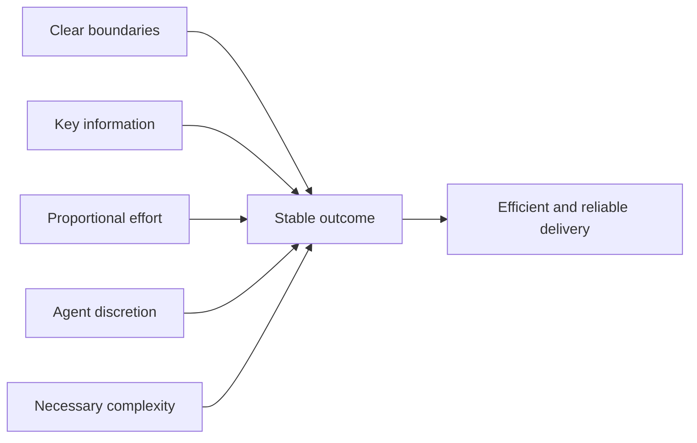

### Three durable documents

The playbook deliberately keeps project state small. Each durable document has
one responsibility:

| Document | Sole responsibility | Lifetime |
| --- | --- | --- |
| [Project adoption manifest](templates/adoption/project-adoption-manifest.md) | Installed immutable revision, canonical project authorities, and stable boundaries | Reused across features |
| [Solution whiteboard](templates/discovery/solution-whiteboard.md) | One active feature's discussion and concluded design | A closing candidate archives it and resets the live copy |
| [Implementation plan](templates/delivery/implementation-plan.md) | Tasks, dependencies, Definition of Done, validation, and all active-delivery state | Removed by the delivery-closing candidate |

Project policies stay in their existing canonical files. The workflow skill
guides the agent but owns no feature state.

Three documents is a storage model, not a reduced-information model. Each
template provides a comprehensive menu for its responsibility: project
authority in the manifest; discovery and design in the whiteboard; and
contracts, architecture, tasks, validation, recovery, and completion in the
plan. Agents keep the applicable information and omit irrelevant ceremony.

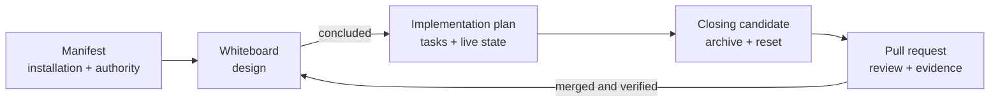

### Where evidence lives

GitHub pull requests own detailed review comments, checks, owner acceptance,
merge evidence, and delivery history. The maintained repository does not copy
that history into extra ledgers or status documents.

| Information | Canonical location |
| --- | --- |
| Project authority and accepted playbook pin | Adoption manifest |
| Feature intent and design decisions | Whiteboard |
| Current task and delivery state | Implementation plan |
| Review findings, checks, acceptance, and merge | Pull request |
| Reusable policy | The owning project policy document |

## Explore the features

### Adopt once and upgrade safely

Adoption reconciles the playbook with the repository that already exists. It
discovers contribution rules, test expectations, security boundaries, and
owner authority; records the accepted immutable playbook revision; prepares an
empty whiteboard; and obtains review of one coherent installation package.

Future features do not repeat adoption. Each delivery first creates its
isolated worktree and owned delivery branch, checks for a newer playbook
revision there, and semantically reconciles current project authority with the
manifest before whiteboard work. New, moved, removed, or changed canonical
policies update stable manifest links and boundaries without repeating adoption
or copying policy text. An upgrade stays in that delivery candidate and never
rewrites its feature-specific whiteboard or plan.

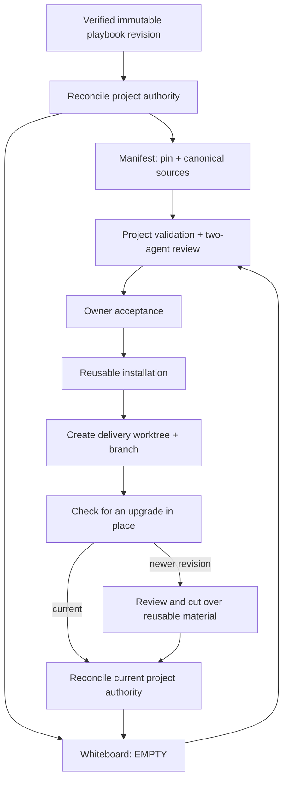

See the [adoption skill](skills/sdd-project-adoption/SKILL.md) and
[upgrade skill](skills/sdd-playbook-upgrade/SKILL.md) for their canonical
outcomes and boundaries.

### Discuss and conclude a design

The whiteboard starts as a lightweight discussion draft. Humans and agents can
explore requirements, constraints, alternatives, risks, and unknowns without
prematurely forcing the conversation into a formal specification. When the
open decisions are settled, the same document retains a concise record of the
material discussion, adds the authoritative concluded design, and reconciles
every draft item so omissions or intentional changes are visible.

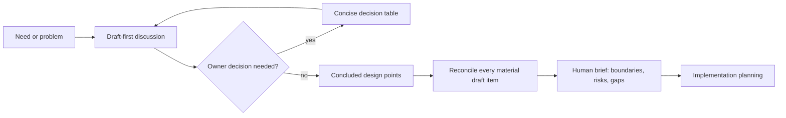

The concluded whiteboard states observable outcomes and important boundaries,
not implementation trivia. If later work changes an observable outcome, the
design receives an explicit amendment; ordinary task progress does not reopen
it.

### Plan and track delivery

The implementation plan turns accepted design points into coherent tasks. It
is both the execution contract and the single state machine for the active
delivery, so the agent does not maintain the same status in several files.

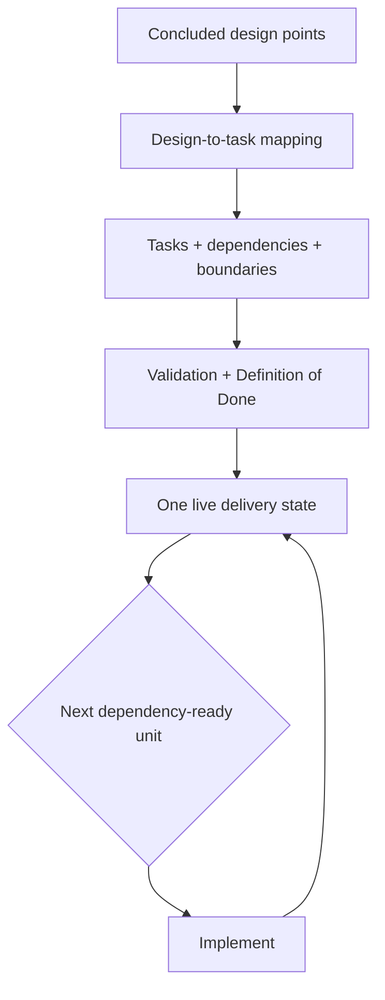

The planning human brief shows design points beside task outcomes and
validation. This makes omissions, unsupported tasks, and inconsistencies
visible without requiring the owner to reread every document word by word.

Before a pull request enters final review, its candidate updates every affected
canonical document to the repository state that will result if it merges. A
task can therefore be `DONE` in the candidate without claiming the PR has
already merged: GitHub owns the pending review, merge, and target-verification
facts. This prevents merged code from leaving stale plan status and avoids a
second bookkeeping pull request.

### Hand off without chat history

The playbook makes development context portable between agents. A fresh agent
does not need a transcript, a proprietary memory, or access to the previous
agent's context window. It reconstructs the delivery from the repository's
canonical sources:

| Source | What the next agent learns |
| --- | --- |
| Adoption manifest and project policies | Installed playbook revision, authority, and stable boundaries |
| Working or concluded whiteboard | Current discussion, decisions, accepted design, and unresolved questions |
| Implementation plan, when present | Current state, task boundaries, dependencies, Definition of Done, and next eligible work |
| Pull requests, when present | Exact changes, review findings, checks, acceptance, and merged evidence |

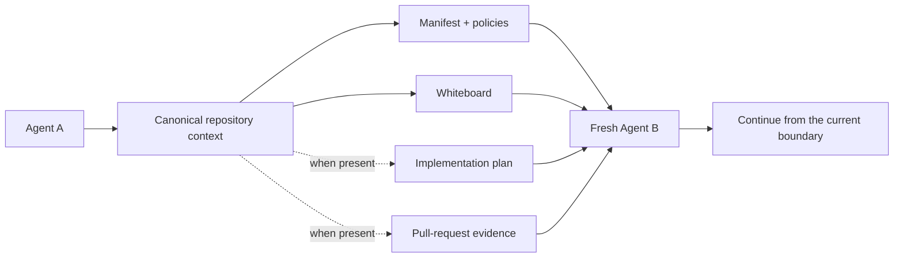

This portability covers information the project records. Required untracked
machine-local inputs—such as environment files, credentials, running services,
or unavailable external decisions—must still be provisioned or surfaced
explicitly. The agent verifies current repository and runtime state before
continuing rather than trusting stale status.

### Implement efficiently

Implementation is organized around coherent, self-contained merge units—not
around a stop after every internal action. The agent may batch related
preparation, coding, corrections, and affected checks inside accepted scope.
Required decisions, safety controls, tests, independent review, and merge
authority remain at their real boundaries.

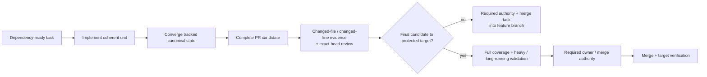

A task may depend on already delivered work, but it cannot depend on a future
change to make its own required result safe or green. Draft-PR timing, internal
working order, tools, and contract-equivalent implementation choices remain
agent decisions unless project policy says otherwise.

### Design tests around risk

The playbook treats tests as evidence for accepted outcomes and invariants, not
as a promise that defects are impossible. Keep essential proof of the critical
happy path, then invest where failures hide: boundaries, malformed or partial
input, errors and recovery, races and interleavings, timing and ordering, and
interface evolution.

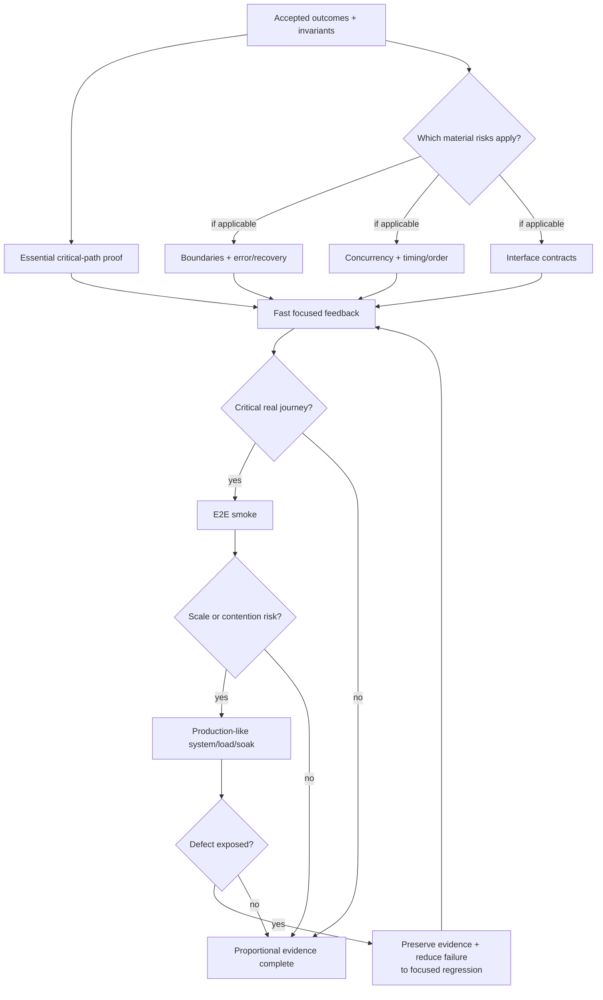

Not every change needs every layer. The agent chooses a proportional portfolio
under project policy. End-to-end smoke demonstrates a valuable real journey;
production-like system, concurrent-load, stress, or soak testing probes scale
and contention only when those risks matter. Broad tests find emergent
failures, while the smallest useful deterministic regression makes a discovered
defect easier to diagnose and prevents its return. The canonical
[risk-focused test design](docs/documentation-quality-policy.md#risk-focused-test-design)
defines the required outcome; implementation plans record only the applicable
project-specific test and acceptance contracts.

Every task still implements the tests its outcome and risks require. The fast
gate executes focused tests and checks only the changed files and lines plus
directly exercised behavior; it does not calculate full-project coverage.
Full coverage and selected heavy or long-running system evidence wait for the
reviewed final candidate that will merge to the protected target, avoiding
repeated cost on intermediate task PRs without deferring test implementation.

### Review for humans and agents

Every material candidate receives self-review, two isolated agent reviews, and
the required human semantic decision. The two agents review the same exact
candidate independently; correction rounds return to the retained reviewer
seats. Their findings and dispositions belong in the PR.

Humans receive a concise table with the information needed for judgment:

| Human need | What the brief exposes | Handling |
| --- | --- | --- |
| Acceptance scope | Outcome, scope/non-scope, exact candidate, and authorized action | Appropriate class |
| Decisions | Important choices, consequences, alternatives, and recommendation | Appropriate class |
| Attention | Risks, assumptions, compatibility effects, exceptions, and owners | Appropriate class |
| Evidence | Passed, failed, and unrun checks plus residual limits | Appropriate class |
| Response | The exact decision requested, or confirmation that none remains | `HUMAN_DECISION` or `NONE` |

The classes tell agents what the emphasis means: `HUMAN_DECISION` stops at an
existing owner boundary, `AGENT_ACTION` is corrected within agent authority,
`DISCLOSE` keeps material awareness-only information, including accepted
limitations, visible without stopping, and `NONE` means no material attention
or action remains.
Split items when they need different handling. The classes add no document or
review gate.
Evidence follows its actual consequence: correctable failures are
`AGENT_ACTION`, while waivers, changed acceptance, or missing authority are
`HUMAN_DECISION`.

At the human review boundary for a pull request, the brief also gives the
change shape for the exact candidate against its real target. The
[quality policy](docs/documentation-quality-policy.md#review-and-human-brief) owns the
category semantics; these numbers are an illustrative example, not live
evidence:

| Change category | Files | Additions | Deletions | Changed lines |
| --- | ---: | ---: | ---: | ---: |
| Product code | 4 | 120 | 18 | 138 |
| Documentation | 2 | 34 | 9 | 43 |
| Tests | 3 | 86 | 12 | 98 |
| Other | 1 | 5 | 5 | 10 |

Each file has one primary semantic category; filenames are only hints. Binary
or otherwise non-line-countable files remain visible as limitations rather
than receiving fabricated totals. The table helps a human understand review
shape without adding another gate or report artifact.

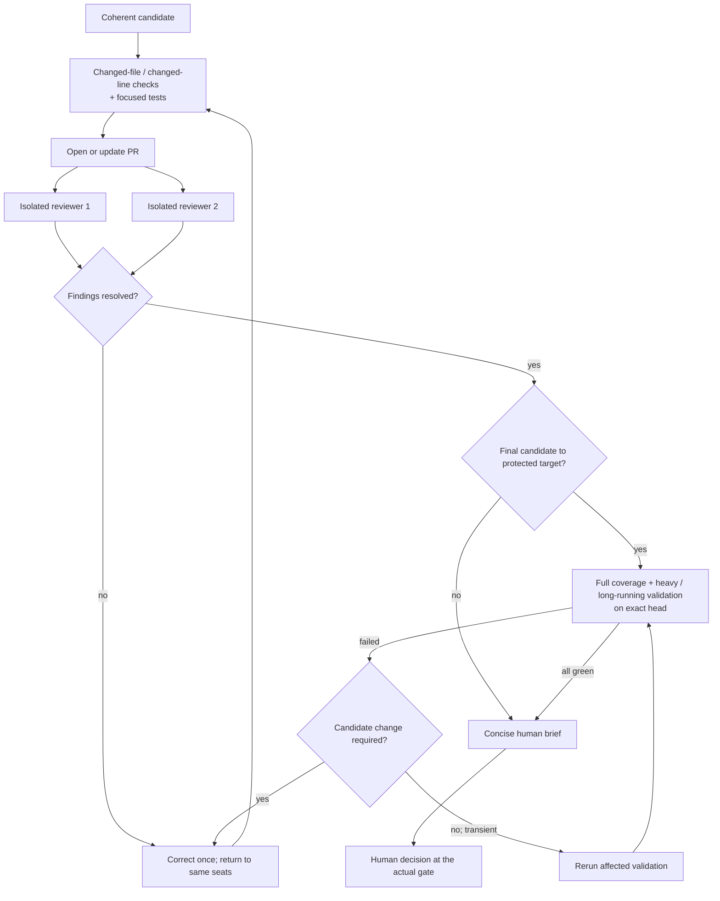

This ordering keeps expensive proof at the protected-target merge boundary
without weakening it or postponing the tests each task must implement.
Intermediate task PRs retain exact-head review with changed-file, changed-line,
and focused-test evidence. Any candidate change returns to fast checks and both
retained reviewers; a final-candidate change also invalidates full validation.
An unchanged transient check failure repeats only the affected validation. A
project's stricter validation policy takes precedence.

Implementation should also remain inspectably proportional. If one task
accumulates one hour of active implementation before its planned review
boundary, the agent stops and explains the time spent, progress, cause,
remaining work, and recommendation, then waits for owner justification or
authorization to continue. Network or environment interruptions, code review,
and waits for people or external systems do not consume that hour.

See [Review and human brief](docs/documentation-quality-policy.md#review-and-human-brief)
for the canonical review outcome.

### Recover without restarting everything

Unexpected behavior is classified by cause and impact. Agent mistakes are
corrected within existing authority. Recoverable failures preserve valid work
and repeat only affected checks. Genuine project or playbook gaps are tracked
in the owning repository. Critical mismatches stop only the affected work and
request human judgment where it is actually needed.

The default is deliberately small: protect named invariants, keep state
consistent, and fail closed when the result is uncertain. Because no design can
enumerate every race or edge case, add recovery machinery only for a required
invariant or observed failure. When retry is safe, expose a stable retryable
outcome and let the client control retry timing; reconcile ambiguous effects
before retrying.

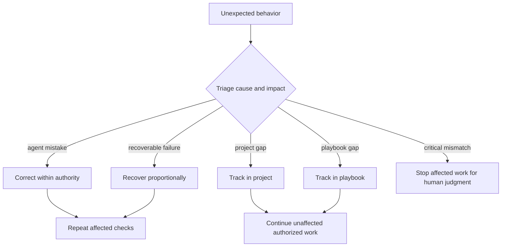

The [error-handling framework](docs/error-handling.md) is the sole shared
authority for recovery and escalation. Other guides link to it instead of
restating increasingly specific error rules.

### Finish, archive, and reset

Delivery finishes only after the accepted outcome is merged and verified on
its target. Before final review, a delivery-closing candidate already archives
the accepted whiteboard with links to its delivery PRs, removes the
implementation plan and other feature-only working material, and resets the
live whiteboard to `EMPTY`. Reusable source output and the adoption manifest
remain. If the PR does not merge, none of that candidate state reaches the
target; after merge, only exact-target verification remains.

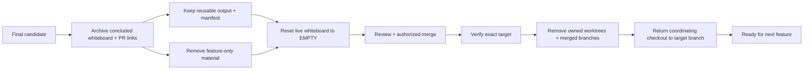

Git history and pull requests preserve the detailed evidence, so cleanup does
not need to manufacture a second archive of implementation records. Operational
cleanup after target verification removes only owned delivery/task worktrees
and merged branches, then returns the coordinating checkout to the target
branch (`main` here) when that will not discard or disrupt other work.

## How efficiency and reliability reinforce each other

### Use proportional effort

The playbook removes duplicated status, artifact-by-artifact review stops, and
unnecessary full reruns. It does not remove the controls that protect the
outcome.

| Expensive pattern | Proportional alternative | Reliability preserved by |
| --- | --- | --- |
| Review every small document separately | Review one coherent candidate | Exact candidate and retained reviewer seats |
| Ask the owner for one approval word at a time | Batch real decisions in a concise table | Explicit consequences and authority |
| Repeat every check after a local correction | Repeat affected checks plus required final gates | Honest check scope and final validation |
| Record status in several files | Keep delivery state only in the plan | Canonical ownership and consistency checks |
| Restart after any failure | Preserve valid work and recover by impact | Cause-based triage and protected stop conditions |

### Keep canonical sources consistent

Each fact has one owner. README prose and diagrams explain the system, but
normative policy remains in the canonical policy document. When an authority,
contract, feature, or lifecycle changes, the agent reconciles its affected
consumers—including README text, diagrams, templates, skills, examples, and
tests—in the same change.

Automated checks catch structural problems such as broken links, malformed
Markdown, invalid Mermaid, placeholders, and three-document violations.
Semantic review catches contradictions that syntax alone cannot understand.

### Support parallel work safely

Deliveries and parallel tasks use isolated worktrees and non-overlapping write scopes. A
worktree receives only the required machine-local untracked inputs, such as an
environment file when the task actually depends on it. Those inputs remain
ignored and untracked, with secrets kept out of Git. The agent exercises a
representative project operation in the worktree itself and diagnoses missing
runtime support. It then copies, recreates, or safely shares only what the
worktree needs and is authorized to use, rather than assuming a source-complete
checkout is operational or blindly cloning the whole main workspace. A
worktree never depends on mutable files or runtime owned by another checkout;
shared support needs stable project-level ownership.

The installer follows the same boundary. Its immutable playbook checkout lives
under that worktree's ignored `.sdd-runtime/checkouts/RESOLVED_SHA/` directory,
not in an operating-system temporary directory. The generated guide and
ownership marker bind it to the repository and physical worktree. Validation
and cleanup reject a checkout copied from another worktree or moved outside the
exact project-local runtime path.

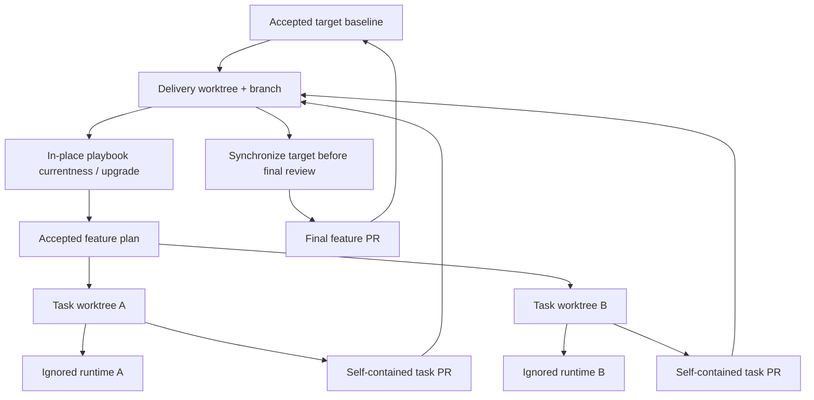

If concurrent deliveries use different playbook revisions, the target branch's
accepted immutable pin is the integration authority. Reconcile only affected
reusable guidance and preserve applicable project decisions; never infer
precedence from a branch name, timestamp, or hash ordering.

The delivery branch's creation point is its ordinary implementation baseline.
Do not continuously merge or rebase the target during implementation. Bring
the completed candidate current with its target, then run affected checks on
that resulting candidate before final review. If the baseline cannot support
safe progress, use the canonical error-handling authority and let the agent
choose a proportional recovery.

## Use the playbook

### Adopt it in a project

1. Copy `install-sdd.sh` into the target repository and run it from the project
   root.
2. Give the generated prompt to the adoption agent.
3. Review the agent's concise adoption brief: discovered authorities, stable
   boundaries, proposed immutable pin, validation, and remaining gaps.
4. After two-agent review and owner acceptance, reuse the installed manifest
   and empty whiteboard for future features.

The numbered list describes the user-facing entry points, not a mandatory
internal execution script. The adoption agent chooses the proportional method
that produces the required result.

### Deliver a feature

Tell the agent what you need. The agent uses the working whiteboard for the
discussion, concludes the accepted design, creates one implementation plan,
and delivers dependency-ready tasks through reviewable PRs. You should be asked
to stop only for a real decision, required semantic review, merge authority,
destructive scope, or a critical mismatch.

At planning review, compare the design-to-task table. At implementation review,
focus on delivered behavior, deviations, compatibility, validation, and the
merge target. At completion, verify planned versus actual outcomes and the
exact cleanup boundary.

### Upgrade an installed project

After creating the delivery worktree and branch, carry the project's existing
ignored `install-sdd.sh` into it with any other required machine-local inputs.
Bootstrap the accepted manifest pin there, then check for a newer revision
before whiteboard or implementation work:

```bash
./install-sdd.sh
./install-sdd.sh --upgrade
```

This two-command form also works with installers from before automatic
fresh-worktree bootstrap was available. A current installer can perform that
bootstrap during `--upgrade` when the guide is absent. Neither path copies
runtime from another worktree.

The old immutable pin remains authoritative until the candidate's reusable
changes pass project validation, two-agent review, owner acceptance, and
cutover validation. Upgrade may read an active plan to judge boundary safety,
but it never rewrites feature design, tasks, status, or evidence. The source
repository's own test suite is not installed into adopting projects.

Keep the upgrade in the delivery candidate. Do not merge a separate upgrade to
the target solely to prepare that delivery.

## Develop this repository

This repository self-adopts the same model. Start with [Contributing](CONTRIBUTING.md),
the live [adoption manifest](.github/spec-driven-delivery/project-adoption-manifest.md),
the [working whiteboard](.github/spec-driven-delivery/solution-whiteboard.md),
and the installer-generated `.sdd-runtime/agent-guide.md`. When present,
`.github/spec-driven-delivery/implementation-plan.md` owns all active-delivery
state.

### Repository map

| Path | Purpose |
| --- | --- |
| `install-sdd.sh` | Resolve immutable revisions and generate isolated runtime guidance |
| `skills/` | Outcome and boundary guidance used by adoption, workflow, and upgrade agents |
| `templates/` | Reusable manifest, whiteboard, plan, and review structures |
| `docs/` | Canonical quality, template-governance, and error-handling policies |
| `scripts/` | Source repository documentation and lifecycle checks |
| `tests/` | Installer and documentation behavior regression coverage |
| `.github/spec-driven-delivery/` | This repository's installed manifest, active whiteboard, and delivery plan |

### Validation

Pull-request automation runs the narrow changed-file and changed-line gate:

```bash
npm run docs:fast -- BASE_REVISION HEAD
```

After both agents approve the exact final candidate, install the exact locked
dependencies and run the complete source gate before human merge acceptance:

```bash
npm ci --ignore-scripts
npm run docs:all
```

The full suite checks Markdown, links and headings, Mermaid syntax, fences,
placeholders, likely secrets, private paths, the three-document model, and
focused installer/lifecycle behavior. Automated checks are necessary evidence,
not a replacement for semantic review.

## References

- [Documentation Quality and Testing Policy](docs/documentation-quality-policy.md)
- [Template Governance](docs/template-governance.md)
- [Error handling](docs/error-handling.md)
- [Project adoption skill](skills/sdd-project-adoption/SKILL.md)
- [Google engineering review guidance](https://google.github.io/eng-practices/review/reviewer/)
- [GitHub documentation on pull-request reviews](https://docs.github.com/en/pull-requests/collaborating-with-pull-requests/reviewing-changes-in-pull-requests)

## License

Licensed under the [Apache License 2.0](LICENSE). You may use, modify, and
distribute the project under its terms.
