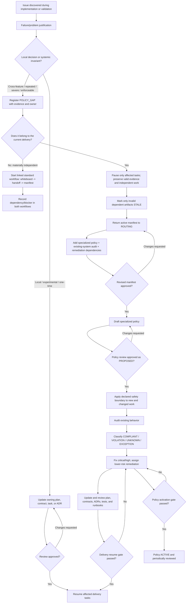

# Mid-Delivery Policy-Gap Rerouting

This guide explains how to handle a specialized-policy need discovered after
implementation begins. It specializes the delivery workflow's feedback rules;
it does not create a second competing workflow.

## Why rerouting is required

An issue found during implementation may expose either:

- a local feature decision, which belongs in the owning plan, contract, task,
  or ADR; or
- a durable systemic invariant that multiple components or future changes must
  follow, which requires a specialized policy and existing-system audit.

Treating every issue as a policy creates governance noise. Treating a systemic
rule as a local patch creates drift and leaves existing violations undiscovered.
The classification and review gates prevent both outcomes.

## Workflow diagram

## Classification

| Question | Local decision | Systemic policy gap |
| --- | --- | --- |
| Scope | One feature/task or experiment | Multiple features/components or future changes |
| Consistency | No repeated decision required | Common ordering, ownership, failure, or security rule required |
| Consequence | Bounded and locally reversible | Severe data, security, billing, concurrency, cost, or availability risk |
| Enforcement | Feature tests/review are sufficient | Shared tests, linting, constraints, review rules, or metrics are needed |
| Destination | Plan, contract, task, or ADR | Specialized policy registry and policy document |

If evidence is insufficient, record `UNKNOWN`, pause only the work exposed to
the possible severe outcome, and investigate. Do not label a test failure as a
policy gap merely because its cause is not yet known.

## Current delivery or separate workflow?

Reroute the current manifest when the policy gap:

- was discovered while delivering its accepted outcome;
- changes assumptions, contracts, tasks, or evidence in that delivery; or
- must be resolved for that delivery to be safe or correct.

Start a separate standard workflow when the issue has an independent need,
owner, scope, acceptance criteria, or release path. Link the workflows and
record whether the new workflow blocks the original. Do not use a separate
workflow to hide scope growth that actually invalidates the active plan.

## Required records and gates

| Record | Purpose |
| --- | --- |
| Failure/problem justification | State observed behavior, expected behavior, evidence, impact, and initial classification before modifications |
| Policy-gap registry entry | Assign identity, owner, risk, scope, and current state |
| Revised manifest | Select policy, audit, remediation, dependencies, review owners, and return paths |
| Task/artifact impact list | Distinguish paused, independent, completed-valid, and stale work |
| `PROPOSED` policy | Define testable invariants and the adoption boundary for new/changed work |
| Existing-system audit | Inventory and classify behavior affected by the new invariant |
| Updated implementation plan | Add remediation, reorder dependencies, and reconcile DOD/evidence |
| Delivery resume gate | Prove affected work can continue safely |
| Policy activation gate | Prove the durable authority can become `ACTIVE` |

The delivery resume gate and policy activation gate are deliberately separate.
For example, affected feature work may resume after the proposed invariant,
critical remediation, and plan updates are approved, while a scheduled audit of
lower-risk legacy paths continues. The policy must accurately remain
`PROPOSED` until its activation criteria pass.

## Example: external I/O under a database lock

During a feature refactor, a reviewer discovers that an existing helper holds
database row locks while calling object storage.

1. The justification records the observed transaction boundary, the expected
   short lock scope, and the deadlock/availability worst case.
2. The rule is systemic because multiple callers and future workflows must
   never hold database locks across external I/O.
3. Because the feature depends on that helper, the current manifest returns to
   `ROUTING`; a separate unrelated workflow would fragment the dependency.
4. Only tasks using the unsafe helper pause. Independent tasks and valid test
   evidence remain intact.
5. The manifest selects a database-locking policy update and an existing-system
   audit. Review approves the policy as `PROPOSED` with immediate enforcement
   for new and changed code.
6. The audit inventories current callers. Critical/high violations become
   blocking remediation tasks; lower-risk work receives owners and dates.
7. The implementation plan is updated and reviewed. Affected feature work
   resumes when its explicit gate passes; the policy becomes `ACTIVE` only when
   its activation gate passes.

## Anti-patterns

- Modifying product or test code before writing the failure/problem
  justification.
- Creating a policy for a single implementation preference.
- Continuing affected tasks while their governing invariant is unresolved.
- Freezing the whole project when only a bounded dependency is affected.
- Marking every downstream artifact stale without showing that its content is
  invalid.
- Starting an independent workflow for same-delivery scope merely to avoid
  revising the active manifest.
- Calling a policy `ACTIVE` before its review, audit, ownership, enforcement,
  and activation gates pass.
- Discarding valid completed evidence instead of reconciling it.
