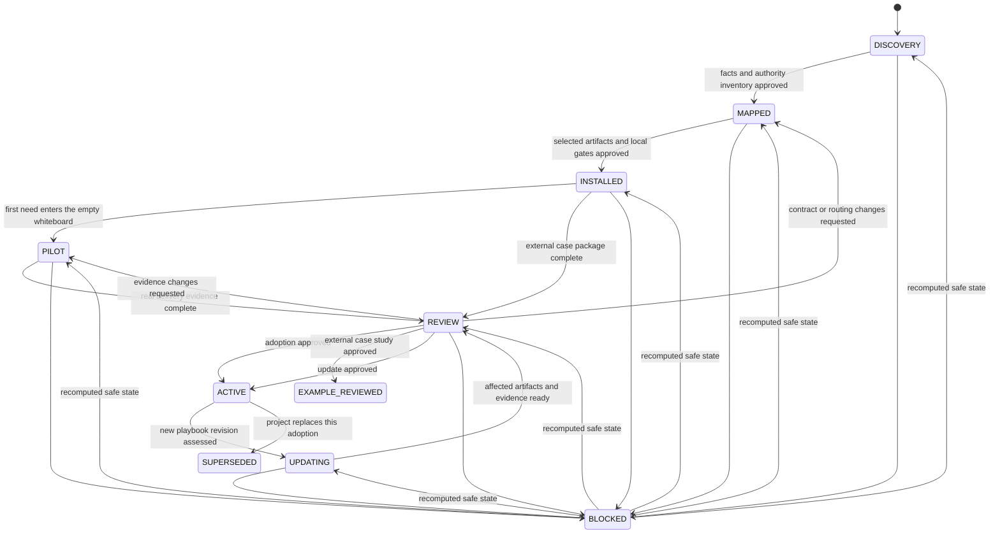

# Project Adoption Runbook

Use this runbook to integrate the playbook into an existing or new project.
It owns the reusable adoption procedure. The
[Project Adoption Manifest Template](../templates/adoption/project-adoption-manifest.md)
records one project's facts, decisions, state, and evidence.

Adoption supplements an existing project. It does not silently replace project
contracts, contributor rules, review authority, tests, or CI. A project reaches
`ACTIVE` only after its own authorized reviewers approve the instantiated
documents, enforcement, and pilot evidence.

## 1. Control and outcome

| Field | Value |
| --- | --- |
| Status | Reusable canonical runbook; changes take effect after reviewed merge |
| Owner | Playbook maintainers |
| Applies to | Initial project adoption and later playbook-version updates |
| Project record | One reviewed adoption manifest in the adopting repository |
| Completion | Real adoption is `ACTIVE`; external case study is `EXAMPLE_REVIEWED` |
| Last source review | 2026-08-22 |

The outcome is a project-local delivery system that:

- preserves established project authority;
- exposes one concise entry point for human and AI contributors;
- instantiates only missing or intentionally changed capabilities;
- enforces project-owned documentation, test, and PR gates;
- proves the integration through one bounded real delivery; and
- can assess later playbook changes without automatic overwrite.

## 2. Authority and conflict gate

Before generating a policy, identify the project's existing authorities and
who can change them. The generic playbook is never project authority merely
because it is newer or more detailed.

Required rules:

- The project defines its own precedence among legal, security, product,
  architecture, contributor, test, release, and operational authorities.
- An approved project document remains authoritative until the project changes
  or supersedes it through its own review process.
- A playbook template is informative input until its instantiated content is
  approved by the project.
- A conflict between a template and project authority is `BLOCKED` until an
  authorized project owner records the disposition.
- Summaries and entry points link to canonical text; they do not create a
  second version of a rule.
- Upstream playbook changes never overwrite an active project document
  automatically.

## 3. Adoption state machine



`BLOCKED` preserves the prior state in the manifest's `State before block`
field, plus the evidence, owner, and explicit unblock condition. Reset it to
`None` after returning to a recomputed safe state. The installer uses this
field to retain the correct adoption or workflow skill while blocked and fails
closed when it is missing or invalid. `INSTALLED` means the project-local entry
point, selected contracts,
artifact locations, and gates are approved. The adoption skill then creates an
empty project solution whiteboard; a need enters only inside that whiteboard.
`ACTIVE` additionally requires evidence from that
first real delivery. It does not imply endorsement by the playbook maintainers
or by any third-party project used in an example. `EXAMPLE_REVIEWED` is the
terminal state for a non-authoritative external-project case study; it never
means that the external project adopted the playbook.

## 4. Inputs and preflight

The preferred bootstrap is [`install-sdd.sh`](../install-sdd.sh), copied to and
run from the target project root. With no explicit revision, it resolves the
latest playbook `main` to an immutable commit. It generates a machine-local
`.sdd-runtime/agent-guide.md`, installs the skill selected from the manifest
state, and prints one agent prompt: follow that guide exactly. The installer
does not collect a product need.

The guide records the source repository, requested and resolved revisions,
temporary checkout, installed skill, ownership marker, and cleanup command.
Only the repository, immutable revision, and materialization mode become
durable manifest fields. Absolute paths and cleanup state remain local runtime
data. Cleanup must verify both the temporary-path boundary and installer
ownership marker before deletion.

Create an adoption branch under the project's normal branch policy. Before
editing project documents, record:

- the exact playbook repository and immutable commit or release;
- how each invocation receives a read-only playbook checkout root or immutable
  URL base without committing a machine-specific absolute path;
- the target repository, base commit, and adoption scope;
- authorized policy, test, documentation, CI, and code-review owners;
- existing dirty or user-owned changes that must be preserved;
- repository contribution, architecture, API, test, CI, release, security, and
  operational authorities;
- available local and CI environments, including costly or restricted
  hardware;
- the project path that will hold the manifest and generated records; and
- whether the adoption is real, an internal trial, or a non-authoritative
  external-project case study.

If a fact cannot be verified, record it as `UNKNOWN`. Do not turn an assumption
into a project rule.

Every adoption agent runs with the target project root as its working directory
and write boundary. The playbook is a separate read-only source dependency. The
manifest stores its durable repository, revision, and materialization mode; the
human or automation supplies the machine-specific playbook locator at runtime.
The agent verifies that binding before reading a playbook artifact.
Neither the manifest nor agent searches the filesystem or guesses a locator.
A missing locator, wrong working directory, or source/revision mismatch is
`BLOCKED` before any project edit.

## 5. Executable integration sequence

The adoption manifest is the state and data connector. The
[Agent Adoption Trigger Template](../templates/adoption/agent-adoption-trigger.md)
is the repeatable trigger. A human or automation invokes the agent for one
manifest action, reviews the result, records the disposition, and only then
allows the next action.

### Step 1 — Pin both repositories

Use a dedicated checkout or worktree. Record the exact playbook revision and
target-project base revision before generation. Never use a moving branch name
as evidence.

Resolve both roots before prompting an agent:

```bash
PLAYBOOK_ROOT="$(git -C spec-driven-delivery-playbook rev-parse --show-toplevel)"
PROJECT_ROOT="$(git -C target-project rev-parse --show-toplevel)"
git -C "$PLAYBOOK_ROOT" rev-parse HEAD
git -C "$PROJECT_ROOT" rev-parse HEAD
```

`PROJECT_ROOT` is the agent working directory and write root. `PLAYBOOK_ROOT`
is a read-only runtime input. Do not commit either machine-specific value.
Commit only the canonical playbook repository, immutable revision, and selected
materialization mode in the manifest.

### Step 2 — Place the first project document

Choose one project-owned adoption root. The first file is always the manifest:

```text
<project-adoption-root>/project-adoption-manifest.md
```

With dedicated local checkouts, create it from the pinned template:

```bash
mkdir -p "${PROJECT_ROOT}/${ADOPTION_ROOT}"
cp "${PLAYBOOK_ROOT}/templates/adoption/project-adoption-manifest.md" \
  "${PROJECT_ROOT}/${ADOPTION_ROOT}/project-adoption-manifest.md"
```

Fill only the playbook repository/revision/materialization mode, runtime locator
contract, target revision, project path, adoption type, owner, branch, and next
action. Leave the state `DISCOVERY`. Do not copy another policy yet.

### Step 3 — Run bounded bootstrap discovery

Prompt the agent to follow `.sdd-runtime/agent-guide.md` exactly. The installed
adoption skill applies Prompt A's boundary from the agent-trigger template and
uses the guide's project root and read-only playbook checkout. The agent
verifies both revisions, then reads the runbook, new manifest, project
instructions, and pinned repository. It updates only repository discovery,
unknowns, and the proposed routing map. It must not create downstream policies
or mark its own work approved.

Before each review stop, the agent completes the adopted self-review record
against the exact candidate revision and records `SELF_REVIEW_PASSED` or
`SELF_REVIEW_FAILED`. A later change invalidates that result. A pass supplies
review evidence but cannot approve adoption, satisfy reviewer independence,
authorize merge, or authorize continuation.

**Review stop A:** an authorized reviewer verifies facts and authority links.
On approval, the reviewer records the review and moves `DISCOVERY -> MAPPED`.
Comments keep the manifest in `DISCOVERY`.

### Step 4 — Install one selected artifact at a time

After review, prompt the agent to follow the same generated guide. The installed
skill applies Prompt B's boundary, verifies that the guide locator matches the
manifest, reads the current state, and starts the next dependency-ready action.
The default `EXPLICIT_REVIEW` mode stops after that action. A reviewed project
authority may preclassify deterministic mechanics as `AUTO_CONTINUE` or
`REVIEW_ON_EXCEPTION`; those actions may continue only through their recorded
automation boundary while every gate passes. `REUSE`, `SKIP`, and `DEFER`
decisions create no copied artifact.

As part of the manifest update for that action, compare changed facts, links,
commands, and availability claims with previously approved artifacts. Record
each affected artifact as `STALE` in the manifest's freshness register. Under
`EXPLICIT_REVIEW`, the immediate next action remains independent review of the
current change; after approval, the earliest dependency-ready stale correction
takes priority. Under an automatic mode, any newly stale artifact, unknown
impact, or exception ends the automation segment and fails closed to explicit
review. Stable entry points and contract registries link to the manifest for
live adoption status instead of duplicating temporary progress statements.

Example: if an approved entry point says a checker is not installed, installing
that checker marks the entry point `STALE`. The checker action still stops for
its own review. After approval, updating only the entry point becomes the next
action; final installation verification waits for that correction and review.

**Review stop B:** review that artifact against the complete mapped project
authority and verify the impact audit. Keep the manifest `MAPPED` while
selected or stale artifacts remain. Repeat Prompt B only after the previous
artifact is approved.

### Step 5 — Verify the installed integration

After every selected artifact is approved and the freshness register contains
no applicable `STALE` or `BLOCKED` artifact, the same guide-driven skill
performs one final installation verification under Prompt B's boundary:

- a human entry point links the project contract registry and start procedure;
- each supported agent entry point links the same canonical procedure;
- whiteboard, handoff, workflow, plan, evidence, and archive locations exist;
- documentation, test, and PR gates are project-owned and executable; and
- the installed empty solution whiteboard can resolve every source without
  hidden chat context; and
- the installed project trigger declares how callers supply and verify its
  runtime playbook locator.

**Review stop C:** independently follow the entry point as a new contributor.
If it works and the manifest has no unresolved adoption blocker, record
`MAPPED -> INSTALLED`. Integration is now complete; the selected skill may now
instantiate the empty project solution whiteboard.

### Step 6 — Initialize the empty solution whiteboard

After `INSTALLED`, prompt the agent to follow the same generated guide. The
skill applies Prompt C's boundary and creates only the empty solution whiteboard
under the installed project path, links the active manifest and project
authorities, and uses neutral initial values. It does not request or infer a
need, or generate a handoff or plan.

#### Runtime handoff from adoption to delivery

After the empty whiteboard and adoption boundary are independently approved,
the adoption runtime is complete. Before recording the first need:

1. Verify that the current guide belongs to the project, matches the manifest's
   playbook repository and revision, selects `sdd-project-adoption`, and records
   cleanup as `PENDING`.
2. From the project root, run `./install-sdd.sh --cleanup`. The installer must
   remove only its verified, owned temporary checkout and mark the guide
   `COMPLETE`.
3. Run `./install-sdd.sh`. With no explicit revision override, the installer
   reuses the manifest's immutable playbook revision.
4. Verify that the regenerated guide detects `INSTALLED`, selects
   `sdd-project-workflow`, preserves the manifest revision, and records the new
   checkout cleanup as `PENDING`.
5. Run `./install-sdd.sh --validate`. Require `CURRENT`; after a compatible
   manifest transition, `STATE_ADVANCED` is acceptable only while the guide
   retains the same workflow profile and skill. Diagnose `STALE_RUNTIME` or
   `INVALID_RUNTIME` before use.
6. Give the agent the regenerated-guide prompt and record the user-supplied need
   only in the reviewed `EMPTY` whiteboard.

If the current verified guide already selects `sdd-project-workflow` for the
reviewed manifest state, reuse it and do not clean it up. A `PENDING` adoption
guide is reusable only while adoption work remains; it must not accept the first
need. If adoption completion or empty-whiteboard approval is missing, stop as
`BLOCKED` instead of cleaning up the active runtime.

For a real project, record `INSTALLED -> PILOT` when the first need is later
recorded in the whiteboard and that workflow starts.
After it delivers and its evidence is reviewed, complete adoption review and
move to `ACTIVE`. A non-authoritative external-project example instead stops at
`EXAMPLE_REVIEWED` and cannot activate the external project.

During delivery, the workflow profile owns the live artifact dependency and
freshness register. Every action compares changed facts and versions with that
register, computes transitive impact, and reviews the current artifact before a
newly stale dependant. Stable entry points link to the manifest/workflow rather
than copying volatile state.

### Step 7 — Re-enter for future deliveries

At delivery closure, the project's normal SDD delivery workflow preserves the
concluded whiteboard in its immutable archive, verifies its bidirectional link
to the delivery record, and replaces the stable working path with a fresh
`EMPTY` whiteboard. It must not overwrite an active, concluded-but-unarchived,
or blocked need.

After the archive and fresh-whiteboard checks pass, the archive step may run
`./install-sdd.sh --cleanup` as its final runtime action to remove the
installer-owned temporary checkout. For a later need, run `./install-sdd.sh`
again. An `INSTALLED` or `ACTIVE` manifest selects `sdd-project-workflow`, and
the manifest's immutable playbook revision is reused unless a separate reviewed
playbook update explicitly changes it. Give the agent the same generated-guide
prompt; record the later need only inside the fresh whiteboard.

## 6. Discovery and authority mapping

Inspect the repository before copying a template. Map every applicable
playbook capability to an existing project authority or a demonstrated gap.
Use the same decisions as the delivery manifest:

| Decision | Adoption meaning |
| --- | --- |
| `REUSE` | Existing project authority already satisfies the need |
| `UPDATE_EXISTING` | Project authority remains canonical but needs a reviewed change |
| `GENERATE` | No suitable authority exists; instantiate the selected template |
| `SKIP` | Capability is not applicable, with a reason |
| `DEFER` | Safe to postpone, with owner and trigger |
| `BLOCKED` | Required fact, authority, environment, or decision is unavailable |

At minimum, assess development, testing, PR/branch, documentation, API,
security, data, concurrency, performance, release, incident, and operations
rules. Do not create specialized policies for hypothetical future needs.

### Decision-level policy conformance

An existing policy is a `REUSE` candidate, not proof of compatibility. Compare
the policy with every applicable decision or obligation in the pinned playbook
template and record project evidence for each item. Equivalent headings and
controls are valid; exact template wording and structure are not required.

Route the result as follows:

- use `REUSE` only when every applicable item has explicit project evidence;
- use `UPDATE_EXISTING` when a required decision is absent or ambiguous;
- record `SKIP` only when the obligation is demonstrably inapplicable; and
- require a reviewed exception with rationale, owner, risk, and equivalent
  control when the project intentionally differs from the playbook baseline.

Do not silently insert a playbook default or infer a choice from current Git
history. A missing project choice remains a gap for its authorized owner. The
updated project policy remains canonical and must pass independent review
before a plan or agent relies on the new rule.

When an incomplete canonical project policy already exists,
`UPDATE_EXISTING` must update that canonical artifact instead of creating a
duplicate, parallel, or replacement policy. One project artifact may own
several policy families, and one family may intentionally be split across
clearly linked authorities. If discovery finds competing or contradictory
copies with no declared precedence, record `BLOCKED` until an authorized owner
selects or consolidates the canonical authority.

### Policy-family conformance inventory

Apply the same audit to every applicable policy family. The table lists minimum
decision areas, not mandatory headings or separate files:

| Policy family | Minimum decision areas to audit |
| --- | --- |
| Development and delivery | change boundaries, task sizing, dependencies, lifecycle states, readiness/completion, defects, and mid-delivery policy gaps |
| Testing and quality | test levels and scope, coverage expectations, environments, failure triage, evidence, exceptions, and documentation-only handling |
| PR and branch | protected targets, branch models, naming, source/target relationships, review/check gates, synchronization, merge, closure, and archive order |
| Documentation and API contracts | canonical sources, precedence, update triggers, compatibility, consumers, review, validation, freshness, and archive rules |
| Security, data, concurrency, and performance | applicable invariants, ownership, threat/risk boundaries, migrations, locking/races, capacity, observability, and enforcement |
| Release, operations, and incident response | environments, approvals, rollout/rollback, recovery, evidence, escalation, incident routing, and post-release reconciliation |
| Specialized policies | observed systemic trigger, scope, proposed/active state, existing-system audit, exceptions, enforcement, remediation, and retirement |

An inapplicable family or decision needs a reviewed reason; it does not need an
empty policy file. A project-specific authority may use different controls, but
the manifest must show where each applicable decision lives and how it meets
or intentionally replaces the playbook obligation.

### PR and branch policy conformance

For a PR and branch policy, assess at least:

- protected integration branch and explicit single-task and multi-task branch
  models;
- the implementation/merge-unit counting rule that selects the branch model;
- feature integration branch owner, lifetime, protected-branch synchronization,
  validation, and closure conditions;
- branch naming and allowed source/target relationships;
- task PR targets and final integration PR target;
- synchronization, merge method, deletion, and abandoned-branch handling;
- required reviews, checks, and final integration validation; and
- merge, post-merge reconciliation, and archive ordering.

For the multi-task model, the delivery must reach and validate the feature branch,
merge its final reviewed PR into the protected branch, reconcile the merged
state, and only then archive the implementation plan. Every task PR targets the
feature integration branch, not the protected branch. An existing policy that
omits any applicable choice routes to `UPDATE_EXISTING`; adoption must not pick
the choice on the project's behalf.

The manifest review gate passes only when:

- every applicable capability has one decision and canonical destination;
- every `REUSE` policy has complete decision-level conformance evidence;
- conflicts, duplication, and unclear authority have dispositions;
- missing policies are supported by observed project evidence;
- deviations from the playbook have a reviewed exception and owner; and
- the smallest safe adoption scope is selected.

## 7. Install the project-local integration

Generate or update one selected artifact per action. Independently review every
semantic or normative result before a dependent artifact proceeds. Only
pre-authorized deterministic mechanics may continue automatically, and only
until the next mandatory semantic checkpoint.

1. Create one concise project development entry point or extend an existing
   one. Link it from the repository locations contributors and supported agents
   actually read.
2. Link the adoption manifest and the project's canonical contract registry.
3. Reuse existing development, test, and PR authorities. Instantiate a
   playbook template only for an approved gap.
4. Define the project working-whiteboard path and where concluded whiteboards,
   handoffs, workflow manifests, plans, decisions, evidence, and archives live.
5. Connect documentation checks to the project's test strategy and PR gates.
6. Record commands, environments, permissions, owners, failure handling, and
   evidence locations. Never claim that the playbook repository's checks ran
   in the project.
7. Review the cross-document graph for competing rules, dead links, missing
   inbound references, and instructions that an AI or new contributor cannot
   discover from the entry point.
8. After each action, invalidate approved artifacts whose recorded facts,
   links, commands, or availability claims changed. Mark them `STALE` in the
   manifest and correct them one at a time before final verification.
9. Keep volatile adoption progress in the manifest. Stable entry points and
   contract registries link to that live state instead of duplicating it.

If central automation is reused across repositories, apply the project's
dependency and security policy. Pin mutable workflow dependencies to an
immutable revision when the platform supports it, and record who reviews
updates.

## 8. Pilot one real delivery

Select one bounded, representative need that the project is already authorized
to deliver. Prefer a change that exercises normal review and test routing
without requiring the project's most expensive or dangerous environment for
the first adoption proof.

Run the approved workflow from whiteboard through delivery record:

1. conclude and review the whiteboard;
2. generate, review, and approve the handoff;
3. route and review the delivery manifest;
4. create only selected artifacts, one at a time;
5. complete the task context receipt before implementation;
6. run the project's required tests and failure triage;
7. satisfy the project's PR and reviewer requirements; and
8. reconcile evidence, retrospective actions, and archive links.

The pilot for a real adoption must use actual project evidence. A historical
replay is permitted only for a non-authoritative teaching case. It labels
reconstructed reasoning and must not claim that the historical authors
followed this playbook or ran new tests.

## 9. Adoption review and activation

The adoption reviewer independently checks:

- repository facts against the pinned target revision;
- authority mappings against the complete existing document set;
- generated documents against active project rules;
- the entry point from a new human or AI contributor's perspective;
- local and CI gate evidence;
- the pilot's state, tests, approvals, and unresolved risk;
- rollback and correction steps; and
- the next review trigger and owner.

Record `APPROVED` or `CHANGES_REQUESTED` for every material manifest item. The
manifest may enter `ACTIVE` only when required items are approved and no
unresolved conflict or fabricated evidence remains. An external-project case
study instead enters `EXAMPLE_REVIEWED` and records why real project activation
is outside its authority.

## 10. Failure handling and rollback

Before changing a document, test, configuration, or workflow after a failure,
record what happened, what was expected, the relevant authority, and whether
the cause is a project defect, adoption-design defect, configuration defect,
environment limitation, or test/checker defect. Fix the responsible layer.

If adoption creates ambiguity, blocks normal delivery, or weakens an existing
gate:

1. pause only affected adoption work;
2. preserve valid project documents and evidence;
3. restore or continue using the last approved authority;
4. mark affected mappings or generated artifacts `STALE`;
5. record the correction or rollback PR; and
6. resume from the recomputed safe state after review.

Do not delete historical adoption evidence merely because the project rolls
back or supersedes the integration.

## 11. Playbook updates and drift

An active project consumes no playbook update automatically. At the project's
review cadence or an event trigger:

1. pin the candidate playbook revision;
2. read its changelog and migration guidance;
3. compare affected templates and rules with the adoption manifest;
4. classify each change as `ACCEPT`, `ADAPT`, `REJECT`, or `NOT_APPLICABLE`;
5. update only affected project artifacts through their normal owners;
6. rerun applicable documentation and delivery gates; and
7. approve a new manifest revision before returning to `ACTIVE`.

Repository templates are appropriate for an initial copy, not synchronization:
GitHub states that repositories created from a template have unrelated
histories. Reusable workflow references can reduce duplicated CI, but GitHub
recommends a commit SHA when consumers require an immutable workflow version.

## 12. External-project example rules

A public project used as a teaching example requires:

- an exact public repository commit and inspection date;
- an immutable playbook checkout; an example stored in that checkout may record
  its own source as the output of `git rev-parse HEAD` instead of embedding an
  impossible self-referential commit hash;
- links to upstream authorities instead of copied normative text;
- a clear no-affiliation/no-endorsement statement;
- separation of verified facts, interpretations, and hypothetical additions;
- no secrets, private data, or claims about unobserved approvals/tests;
- no upstream change or message without explicit authorization; and
- a drift warning that requires revalidation before reuse.

## 13. Definition of Done

- [ ] Source and target revisions are immutable and recorded.
- [ ] Existing project authorities and owners are verified.
- [ ] Every applicable playbook capability has a reviewed adoption decision.
- [ ] Conflicts, deviations, gaps, and deferred work are explicit.
- [ ] Project-local contracts and the contributor/agent entry point are linked.
- [ ] Documentation, PR, and test enforcement passes in the adopting project.
- [ ] The manifest is `INSTALLED`, and the selected skill creates only the
      empty solution whiteboard without hidden context or an inferred need.
- [ ] A real adoption completed one bounded real delivery; an external teaching
      case completed its declared evidence without claiming project adoption.
- [ ] Any historical replay labels reconstructed reasoning and unrun evidence.
- [ ] Adoption review, rollback, update ownership, and next review are recorded.
- [ ] A real adoption is `ACTIVE` through project authority, or a
      non-authoritative external case is `EXAMPLE_REVIEWED` without an adoption
      claim.

## 14. References

- [GitHub — Creating a repository from a template](https://docs.github.com/en/repositories/creating-and-managing-repositories/creating-a-repository-from-a-template): template-derived repositories have unrelated histories.
- [GitHub — Reusing workflow configurations](https://docs.github.com/en/actions/concepts/workflows-and-actions/reusing-workflow-configurations): immutable SHA references and reusable-workflow trade-offs.
- [Google Engineering Practices — Small CLs](https://google.github.io/eng-practices/review/developer/small-cls.html): self-contained increments, related tests, and working integration targets.
